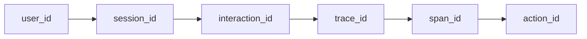
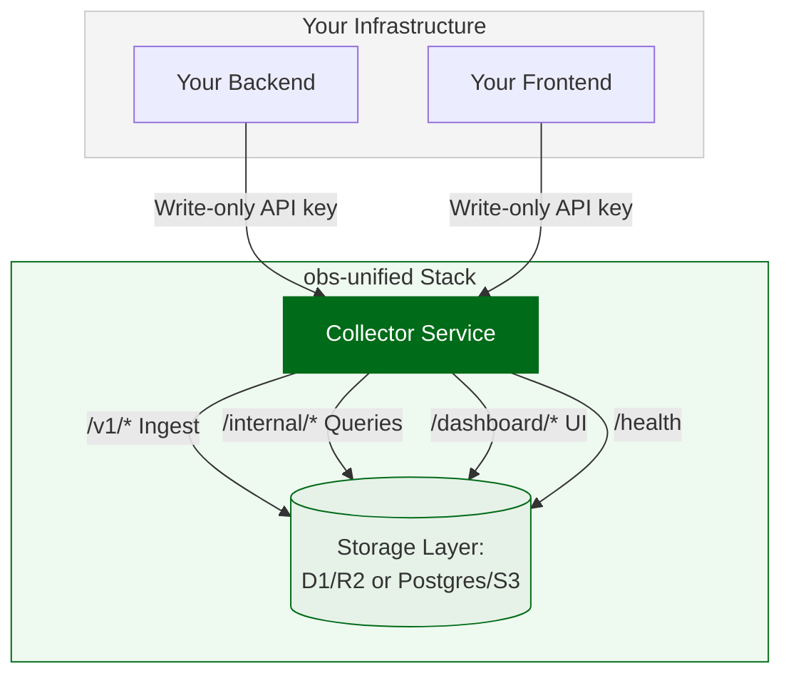

# obs-unified

Self-hosted observability for agentic debugging. Traces, logs, session replay,
usage analytics, AI cost, profiles, Agent Action Graphs, and a read-only MCP
server live in one collector and one dashboard, correlated end-to-end.

[](LICENSE)
[](https://docs.obsunified.com/docs)
[](https://obsunified.com)

## Why obs-unified?

Modern debugging now has two users: engineers and AI agents. Most observability
stacks split evidence across APM, logs, product analytics, session replay, LLM
observability, profiling, and alerting. obs-unified keeps those signals together
so a person or agent can follow one chain:



That means a checkout click, AI cost spike, failed tool call, alert, profile hot
frame, or missing-instrumentation gap can lead to the backend trace, related
logs, replay, AI calls, agent steps, tool calls, eval cases, and CPU/profile
evidence without copy-pasting IDs between vendors.

For agents, the important part is not only that the data is colocated. The
collector returns machine-readable evidence: entity IDs, routes, confidence,
sources, citations, and suggested next pivots. An AI debugger can follow the
same graph the dashboard shows, while still knowing which causal edges were
explicitly propagated and which were fallback-derived.

## What you get

| Area | What ships |
| --- | --- |
| Unified ingest | OTLP traces, structured logs, usage events, rrweb replay chunks, AI spans, profiles, alerts, analyses, and Agent Action Graph records |
| Dashboard | Health, traces, logs, service map, issues, AI calls, replay, timeline, alerts, usage, resources, cost attribution, evaluations, and action graph views |
| Agent Action Graph | Causal view of agent runs, LLM calls, retrievals, tool calls, guardrails, evals, traces, logs, profiles, and replay evidence |
| Agent-readable evidence | Structured evidence references with entity IDs, routes, confidence, citations, source fields, code references, and suggested pivots |
| MCP server | Read-only investigation tools for agents: status, traces, logs, service map, users, replays, profiles, evals, connected signals, agent runs, actions, and tool calls |
| SDKs | Browser + React analytics SDK, TypeScript backend SDK, OpenTelemetry wrappers for Node, Go, and Rust |
| Deployment | Local Docker image, Cloudflare Workers with D1/R2, or Node collector on any cloud with Postgres and S3-compatible storage |

[](https://obsunified.com)

<sub>More views: [AI cost & LLM spans](https://obsunified.com/screenshots/app/ai-cost-spans.png) ·
[Unified timeline](https://obsunified.com/screenshots/app/timeline-unified.png) ·
[Agent Action Graph](https://obsunified.com/screenshots/app/agent-action-graph.png) ·
[Interaction ID path](https://obsunified.com/screenshots/app/interaction-id-path.png) ·
see all on [obsunified.com](https://obsunified.com)</sub>

## Feature tour

| Feature | Why it matters |
| --- | --- |
| **Traces + logs** | Standard OpenTelemetry spans and structured logs land in the same store, with trace correlation available from the dashboard and MCP tools. |
| **Session replay + usage analytics** | Frontend behavior is not a separate product. Page views, interactions, errors, identity, and replay chunks are tied to the same session and interaction IDs. |
| **AI cost and LLM observability** | Model, provider, tokens, latency, cost, error category, prompt/output payloads, and trace context stay queryable together. |
| **Agent Action Graph** | Agent work is represented as a causal graph, not loose LLM spans. You can see what the agent did, what each step caused, and which evidence supports the result. |
| **Profiles and resources** | CPU/profile evidence and resource context can join the same incident path instead of living in a separate profiling tool. |
| **Evidence and drilldowns** | Analyses, alerts, evals, instrumentation gaps, and aggregates return concrete evidence references, exemplar traces/actions, confidence, and next pivots. |
| **MCP investigation server** | Agents can inspect the graph with read-only tools, without receiving write-only ingest credentials. |

## How agents debug with obs-unified

obs-unified is designed for the loop a coding agent needs when it is asked to
debug production behavior:

1. Start from a symptom: alert, analysis, trace, log, user session, AI cost
   spike, tool failure, profile hot frame, or resource metric.
2. Read structured evidence references instead of scraping prose. Evidence
   includes the entity kind, ID, route, source, confidence, citations, and
   suggested pivots.
3. Traverse Connected Rail from the anchor to neighboring signals: spans, logs,
   usage events, replay sessions, AI calls, profiles, actions, tool calls, evals,
   and agent runs.
4. Check trust indicators. Explicit action IDs are high confidence;
   fallback-derived action IDs are useful but visibly marked so the agent does
   not invent causality.
5. Move from root cause to fix context: code references, side-effect
   before/after evidence, production-to-eval cases, and side-by-side agent step
   comparisons.

This is why the dashboard and MCP server share the same investigation surface.
Humans get visual pivots; agents get stable IDs and structured responses.

## Agent Action Graph

obs-unified now includes an Agent Action Graph for debugging AI agents as
causal workflows instead of loose LLM spans. Browser clicks, cron jobs, agent
runs, LLM calls, retrievals, tool calls, guardrails, backend traces, logs,
profiles, and eval cases are linked through `root_action_id`, `action_id`, and
`caused_by_action_id`.

Use it to answer which user action or background job started a run, which model
step chose a side-effecting tool, whether the write was approved, what changed
before and after a mutation, whether an eval failed, and whether a production
failure should become an eval case.

The graph is also agent-readable. The `@obsunified/mcp-server` package is the
obs-unified investigation MCP server: it exposes read-only tools for status,
recent traces, trace detail, service maps, logs, AI sessions, users, replays,
profiles, evals, connected signals, agent runs, actions, and tool calls. Coding agents can
traverse the same evidence a human sees in the dashboard without receiving
ingest credentials.

Typical agent-debugging paths:

- **AI cost spike:** cost aggregate -> expensive session or AI call -> trace/span
  -> action -> agent run -> tool/eval context -> prompt/model/version evidence.
- **User-facing failure:** user -> latest session -> replay/usage event -> trace
  -> logs -> causing action or side-effecting tool.
- **Slow request:** service operation or trace -> hot span -> profile or
  instrumentation-gap evidence -> code reference.
- **Unsafe autonomous write:** autonomous review aggregate -> action/tool call
  -> before/after mutation evidence -> eval case or version comparison.

Start here:

- [Product overview](docs/agent-action-graph.md)
- [EvidenceReference contract](docs/spec/evidence-reference.md)
- [MCP terminology](docs/mcp.md)
- [Investigation MCP server package](packages/mcp-server/README.md)
- [Action ID wire spec](docs/spec/action-id.md)
- [Framework plugin contract](docs/spec/agent-framework-plugins.md)
- [Agent replay worked example](docs/ux/agent-run-replay.md)

## Deployment options

Start locally, then choose one of two production paths:

| Path | Storage | Best for |
| --- | --- | --- |
| Local all-in-one image | Postgres + blob storage in one container | Evaluation, screenshots, demos, local development |
| Cloudflare collector | Workers + D1 + R2 | Low-ops hosted deployments on Cloudflare |
| Node collector | Postgres + S3-compatible object storage | AWS, GCP, Azure, Fly.io, Render, Kubernetes, or any cloud with Postgres and object storage |

## Try it

Pull the prebuilt all-in-one image (Postgres, collector, dashboard, and seed
data in one container):

```bash
docker run --rm -p 5173:5173 -p 8790:8790 ghcr.io/obs-unified/local:latest
# → http://localhost:5173   (dashboard password: e2e-test-pass)
```

If you are working from a clone instead, you can build and run it locally: `pnpm local:image && pnpm local:run`.
Prefer to run from source? See [docs/getting-started.md](docs/getting-started.md).

> Installing the SDKs into **your own** app needs a one-time GitHub Packages
> login — covered in [Instrument your app](#instrument-your-app) below and in
> [docs/github-packages.md](docs/github-packages.md). The MCP server publishes
> to npmjs and does not need that login.

## See it with sample data

Two paths, depending on whether you have Docker.

#### Recommended — point the OpenTelemetry Astronomy Shop at the collector

> Requires Docker + docker-compose v2. ~6 GB RAM. First run pulls ~3 GB of
> images. No Docker or a smaller machine? Use the synthetic seeder below
> (~70 spans, no images to pull).

The canonical OSS observability demo (~15 microservices in Go / Java / .NET /
Node / Python / Rust, all emitting OTLP natively) becomes our data source. It
includes a Locust load generator that drives the React frontend continuously,
and built-in feature flags for failure injection that exercise Service Map +
Issues realistically.

```bash
pnpm dev:collector   # in one terminal
pnpm demo:setup      # one-time: clones the demo into demo/upstream/
pnpm demo:up         # docker compose up; ~30 s to first traffic
```

Open `http://localhost:5173` — Traces, Service Map, Issues, Logs, and Metrics
all populate from real microservice traffic. Tear down with `pnpm demo:down`.
Full details: [demo/README.md](demo/README.md).

#### Fallback — synthetic seeder (no Docker)

Faster but less realistic — writes ~70 spans, 20 logs, 12 AI calls, 49 usage
events, one Scenario A CPU profile, and 3 alert rules straight to the collector:

```bash
pnpm run dev      # start collector + demo + dashboard (in separate panes works too)
pnpm run seed
```

The synthetic seeder doesn't generate Service Map edges or sustained load; use
it when you want to iterate on UI without booting Docker.

```bash
# overrides
node scripts/seed-everything/run.mjs \
  --collector http://localhost:8790 \
  --rounds 10
```

The only tab that needs a real browser regardless is **Replays** — rrweb chunks
are captured client-side, so visit the Playground tab and click "Start replay"
once.

## Architecture

For the component inventory and deployment shapes, see
[docs/system-components.md](docs/system-components.md).



#### Architecture Flow Explanation

- **Your Infrastructure**: The applications under observation. The backend and
  frontend services are configured with a single write-only API key (similar to
  platforms like Sentry or PostHog) to interact with the collector.
- **Collector Service**: The core ingestion engine of the `obs-unified` stack.
  It receives client data, hosts the visualization dashboard, handles
  validation, and serves internal reporting queries.
- **Storage Layer**: Telemetry data is persisted locally (backed by SQLite/D1
  and Cloudflare R2) or dynamically mapped to an enterprise Postgres database
  and S3-compatible blob bucket (like MinIO or AWS S3).

**Two auth boundaries:**

- **SDK to Collector** — write-only API key (like PostHog/Sentry)
- **Dashboard** — password login (like Grafana)

## Instrument your app

Start by choosing your language and framework, then follow the matching example:

| App shape                      | Start here                                                        |
| ------------------------------ | ----------------------------------------------------------------- |
| Not sure yet                   | [Examples index](docs/examples.md)                                |
| React/Vite frontend + Hono API | [React + Hono walkthrough](docs/howto/instrument-react-hono.md)   |
| Python Flask API               | [Python Flask walkthrough](docs/howto/instrument-python-flask.md) |
| Browser-only app               | [Analytics SDK README](packages/analytics-sdk/README.md)          |
| TypeScript backend             | [Telemetry SDK README](packages/telemetry-sdk/README.md)          |
| AI agents and tool-calling apps | [Agent Action Graph overview](docs/agent-action-graph.md), [MCP terminology](docs/mcp.md), and [investigation MCP server](packages/mcp-server/README.md) |
| Python, JVM, .NET, Go, Rust    | [Language recipes](docs/recipes/README.md)                        |

The common wiring is: run a collector, add the browser/backend SDK package, set
`OBS_COLLECTOR_URL` plus an ingest key, allow the `x-obs-interaction` CORS
header for browser calls, and verify the collector path with
`pnpm dlx @obs-unified/cli doctor` (after the GitHub Packages login below).
For agents, install the MCP server from npmjs without registry auth:

```bash
pnpm add -g @obsunified/mcp-server
```

> [!NOTE]
> The MCP server uses the hyphen-less `@obsunified` scope on public npm (`@obsunified/mcp-server`); the first-party SDKs use the hyphenated `@obs-unified` scope on the GitHub Packages registry (`@obs-unified/*`).

### Install the SDKs

The TypeScript SDK packages publish to GitHub Packages. Configure the
`@obs-unified` scope once for SDK installs (GitHub Packages requires
authentication even for public packages — see
[docs/github-packages.md](docs/github-packages.md) for token setup and the
Go/Rust install paths):

```bash
pnpm config set @obs-unified:registry https://npm.pkg.github.com
pnpm login --scope=@obs-unified --auth-type=legacy --registry=https://npm.pkg.github.com
```

### 1. Instrument Your Backend

```bash
pnpm add @obs-unified/telemetry-sdk
```

```typescript
import {
  initObservability,
  createLogger,
  trackAICall,
} from "@obs-unified/telemetry-sdk";

// Initialize once at startup
initObservability({
  collectorUrl: "https://obs.my-app.com",
  apiKey: process.env.OBS_INGEST_KEY!,
  serviceName: "my-api",
});

// Create loggers per module
const logger = createLogger("users");

// Use in your routes
app.get("/users", async (c) => {
  logger.info("Listing users");
  const users = await db.users.findMany();
  return c.json(users);
});

// Track AI calls
trackAICall({
  modelName: "claude-sonnet-4-20250514",
  provider: "anthropic",
  callType: "chat",
  promptTokens: 150,
  completionTokens: 80,
  latencyMs: 1200,
  totalCostUsd: 0.003,
});
```

### 2. Instrument Your Frontend

```bash
pnpm add @obs-unified/analytics-sdk
```

```tsx
import {
  AnalyticsProvider,
  useAnalytics,
} from "@obs-unified/analytics-sdk/react";

// Wrap your app
function App() {
  return (
    <AnalyticsProvider
      collectorUrl="https://obs.my-app.com"
      apiKey="your-public-ingest-key"
      trackPageViews
      captureErrors
    >
      <YourApp />
    </AnalyticsProvider>
  );
}

// Use in components
function CheckoutButton() {
  const { trackInteraction, identify } = useAnalytics();

  return (
    <button
      onClick={() => {
        trackInteraction("checkout_click", { plan: "pro" });
        identify("user-123", { email: "user@example.com" });
      }}
    >
      Checkout
    </button>
  );
}
```

### 3. Open the Dashboard

Visit your collector URL in a browser. Enter the dashboard password. Done.

```
https://obs.my-app.com/dashboard
```

## Production Deployment

If this is your first run, start with the
**[Getting Started Guide](docs/getting-started.md)**. For production scaling
setups, see the **[Production Operations Guide](docs/ops/production.md)**. For
standard integration codes across languages, see the
**[SDK API Reference Cheat Sheet](docs/sdk-reference.md)**.

### Deploy the Collector

The collector is a standalone service that receives telemetry and serves the
dashboard.

```bash
pnpm add @obs-unified/collector hono
```

```typescript
// collector/src/index.ts
import {
  createDefaultCollectorApp,
  createRetentionCleanupHandler,
  createIngestAuth,
  createDashboardAuth,
} from "@obs-unified/collector";

const app = createDefaultCollectorApp({
  auth: {
    middleware: createIngestAuth({
      secret: env.INGEST_KEY,
    }),
  },
  dashboardAuth: createDashboardAuth({
    password: env.DASHBOARD_PASSWORD,
  }),
  allowedOrigins: env.ALLOWED_ORIGINS, // your frontend origin(s)
});

export default {
  fetch: app.fetch,
  scheduled: createRetentionCleanupHandler().scheduled,
};
```

Set environment variables:

| Variable                | Required    | Description                       |
| ----------------------- | ----------- | --------------------------------- |
| `INGEST_KEY`            | Yes (prod)  | Write-only API key for SDKs       |
| `DASHBOARD_PASSWORD`    | Yes (prod)  | Password for dashboard login      |
| `ALLOWED_ORIGINS`       | Recommended | Comma-separated CORS origins      |
| `RETENTION_HOURS`       | No          | Data retention window, default 72 |
| `ALLOW_UNAUTHENTICATED` | No          | Set `"true"` for local dev        |

## Packages

- `@obs-unified/collector`: Collector service. Receives telemetry, stores it in
  D1/SQLite or Postgres, and serves dashboard APIs.
- `@obs-unified/telemetry-sdk`: Backend SDK for Cloudflare Workers. Provides
  structured logging, request spans, D1/R2/fetch wrappers, and AI call tracking.
- `@obs-unified/analytics-sdk`: Frontend SDK for page views, interactions,
  browser errors, and session replay.
- `@obs-unified/dashboard`: React dashboard components, also used by the
  standalone dashboard SPA.
- `@obs-unified/types`: Shared TypeScript types and constants.

## Polyglot SDKs ([`sdks/`](./sdks))

Thin OpenTelemetry SDK wrappers for non-Workers languages. They configure the
standard OTel SDK to point at this collector and add OpenInference helpers for
LLM/tool spans and project propagation. HTTP / DB / RPC auto-instrumentation
comes from the OTel ecosystem of each language.

| Language             | Path                       | Package                                      |
| -------------------- | -------------------------- | -------------------------------------------- |
| Node.js / TypeScript | [`sdks/node`](./sdks/node) | `@obs-unified/sdk`                           |
| Go                   | [`sdks/go`](./sdks/go)     | `github.com/obs-unified/obs-unified/sdks/go` |
| Rust                 | [`sdks/rust`](./sdks/rust) | `obs-unified`                                |

Each SDK exposes the same surface — see [`sdks/README.md`](./sdks/README.md) for
the cross-language API map. The instrumentation philosophy (what's auto vs.
manual, when to annotate, how span nesting works) is documented once in
[`packages/telemetry-sdk/INSTRUMENTATION_GUIDE.md`](./packages/telemetry-sdk/INSTRUMENTATION_GUIDE.md).

## Framework Examples

### Hono (Cloudflare Workers, Node.js, Deno, Bun)

```typescript
import { Hono } from "hono";
import { initObservability, createLogger } from "@obs-unified/telemetry-sdk";

const app = new Hono();

app.use("*", async (c, next) => {
  initObservability({
    collectorUrl: c.env.OBS_COLLECTOR_URL,
    apiKey: c.env.OBS_INGEST_KEY,
    serviceName: "my-api",
  });
  await next();
});
```

### Next.js

```typescript
// lib/observability.ts
import { initObservability } from "@obs-unified/telemetry-sdk";

initObservability({
  collectorUrl: process.env.OBS_COLLECTOR_URL!,
  apiKey: process.env.OBS_INGEST_KEY!,
  serviceName: "my-nextjs-app",
});
```

### Express

```typescript
import express from "express";
import { initObservability, createLogger } from "@obs-unified/telemetry-sdk";

initObservability({
  collectorUrl: process.env.OBS_COLLECTOR_URL!,
  apiKey: process.env.OBS_INGEST_KEY!,
  serviceName: "my-express-app",
});

const logger = createLogger("server");
const app = express();

app.get("/health", (req, res) => {
  logger.info("Health check");
  res.json({ status: "ok" });
});
```

## Embedding the Dashboard

For teams that want to embed observability views in their own admin panel:

```tsx
import {
  ObsDashboardProvider,
  TelemetryDashboard,
} from "@obs-unified/dashboard";

function AdminObservability() {
  return (
    <ObsDashboardProvider basePath="/api/obs">
      <TelemetryDashboard mode="traces" onNavigate={() => {}} />
    </ObsDashboardProvider>
  );
}
```

## Local Development

```bash
pnpm install
pnpm run setup     # Initialize database
pnpm run dev       # Start collector (:8790), API (:8787), web (:5173)
```

## What Gets Collected

- **Traces** — Request spans with timing, status, and attributes (OTLP format)
- **Logs** — Structured logs with severity, trace correlation, and attributes
- **Usage** — Page views, interactions, frontend errors, UTM parameters
- **Session Replay** — DOM recording via rrweb for visual session playback
- **AI Calls** — Model name, provider, tokens, cost, latency, errors
- **User Profiles** — Identity linking (visitor ID to user ID)
