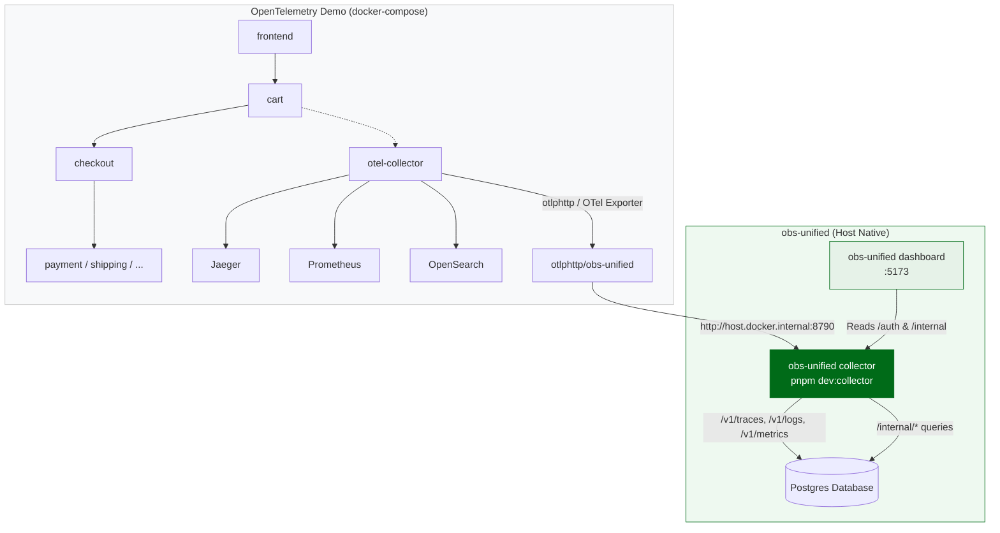

# Demo workload — OpenTelemetry Astronomy Shop

Instead of synthesizing telemetry, we point the **canonical OpenTelemetry
demo** at our collector. That gets us:

- ~15 services in 6+ languages (Go / Java / .NET / Node / Python / Rust)
  emitting OTLP natively across traces, logs, and metrics.
- A real React frontend driven by a Locust-based load generator → constant,
  realistic traffic.
- Built-in feature flags for **failure injection** (`paymentServiceFailure`,
  `productCatalogFailure`, `recommendationCacheFailure`,
  `loadgeneratorFloodHomepage`, …) so we can see Issues and Service Map react
  to actual outages.

## Architecture



#### Demo Architecture Flow Explanation
* **OpenTelemetry Demo Stack**: A multi-container Docker compose environment mimicking a real-world web shop. Its internal services (cart, checkout, shipping, etc.) emit traces and logs to the local `otel-collector`.
* **Telemetry Routing**: The standard OTel collector is configured to simultaneously push data to its default debug backends (Jaeger, Prometheus, and OpenSearch) **and** export OTLP payloads to our host `obs-unified` collector endpoint via a custom `otlphttp` exporter.
* **obs-unified Stack**: Receives these OTLP streams on `:8790` and stores them in your local PostgreSQL database, where the frontend React dashboard on `:5173` queries the endpoints to visualize the real-time topology, service maps, and error spikes.

The demo keeps shipping data to its own backends (Jaeger / Prometheus /
OpenSearch) **and** to ours. We don't fork their config — we layer an
"extras" file that just appends one additional exporter.

## Files

```
demo/
├── README.md                    # this file
├── setup.sh                     # clone + patch (idempotent)
├── otelcol-config-extras.yml    # the actual integration: appends our
│                                # otlphttp exporter to every pipeline
└── upstream/                    # gitignored; the cloned demo lives here
```

## Prerequisites

- **Docker** + **docker-compose v2** (the demo defines ~25 containers,
  needs ~6 GB RAM; `docker-compose v1` will fail on profile syntax).
- `git` (the setup script clones from GitHub).
- The obs-unified collector running on `localhost:8790`.

## Run

```bash
# one-time clone + patch
pnpm demo:setup

# in another terminal (must be running first)
pnpm dev:collector

# boot the demo — first run pulls ~3 GB of images
pnpm demo:up

# follow the demo's load-generator logs (optional)
pnpm demo:logs

# tear down (containers + volumes)
pnpm demo:down
```

After ~30 seconds the load-generator starts driving traffic. Visit:

| Tab | What to expect |
|---|---|
| Traces | ~10 services, mixed status, p95 around 200ms |
| Service Map | full topology with edges + error-rate coloring |
| Issues | groups for any feature flag you've toggled |
| Logs | structured logs from every service |
| AI Calls | only if you've enabled the LLM-powered chat assistant in the demo's flagd config |

## Tweaking

- **Different ingest key / project**: edit
  `demo/otelcol-config-extras.yml`, change the `authorization` /
  `x-project-id` headers, then `pnpm demo:setup` to copy the change
  into `upstream/` and `docker compose restart otel-collector` to pick
  it up. (The OTel collector's expander doesn't read shell-style
  `${VAR:-default}` so we can't surface these as env vars without
  threading them through `demo/upstream/.env` and switching to the
  `${env:VAR}` syntax.)
- **Inject a failure** (toggle a flag in the demo's UI at
  `http://localhost:8080/feature` or the flagd config in
  `demo/upstream/src/flagd/demo.flagd.json`).
- **Pin to a specific demo version**:
  ```bash
  UPSTREAM_REF=v1.10.0 pnpm demo:setup
  ```

## Why this not a synthetic seeder

We had `scripts/seed-everything/run.mjs` writing OTLP by hand. It worked
but it was a permanent maintenance task: every dashboard tweak required
revisiting fake span shapes, fake session correlations, fake AI call
attributes. The OTel demo emits everything we'd ever need to seed,
correctly, forever — and it's the same shape Datadog / Honeycomb / New
Relic users see when *they* try the demo. Free credibility.

The synthetic seeder still ships (`pnpm seed`) for cases where you want
something fast and Docker-free — but the demo is the recommended path
when iterating on UI behaviour.
