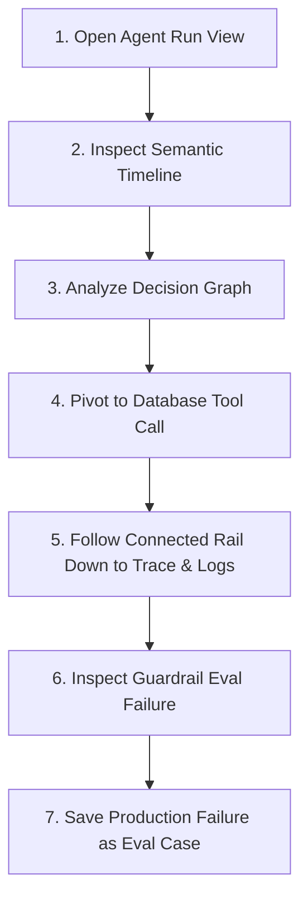

# Worked Example: Investigating a Silent Agent Failure

Status: proposed / draft (Phase 0.4)  
Owner: obs-unified product & design  
Parent RFC: [RFC 0010 — Agent Action Graph](../../rfcs/0010-agent-action-graph.md)

This document walks through a concrete troubleshooting journey in the obs-unified dashboard: an engineer investigating why a support agent updated the wrong invoice in production, eventually promoting the failed production run to a test case.

---

## The Scenario

An enterprise customer, Stark Industries, opened a ticket reporting that their last invoice (`INV-2026-9912`) was modified with an incorrect billing address (`100 Main St.`), which belongs to ACME Corp. 

The customer support agent responsible for billing updates is fully automated. In traditional APM systems, this results in a few isolated HTTP traces and generic SQL log lines, requiring manual reconstruction. 

With obs-unified's **Agent Action Graph**, the engineer traces the entire chain of causality in seconds.

---

## Step-by-Step Troubleshooting Flow



---

### Step 1: Open the Agent Run
The engineer starts by navigating to the **Agent Runs** log or searching for the invoice identifier `INV-2026-9912`. They find the executing run:
- **Agent Name**: `Billing Operations Assistant`
- **Agent Run ID**: `01J3Y4Z5A6B7C8D9E0F1G2H3J4`
- **Autonomy Level**: `autonomous_write`
- **Status**: `error` (due to an internal guardrail failure, though the tool call succeeded)

Upon clicking the run, they are presented with the **Agent Run Replay** detail screen. This is a semantic replay of the agent's cognition, not a raw session playback.

---

### Step 2: Inspect the Semantic Timeline
The timeline visualizes the exact sequence of thoughts, decisions, actions, and side effects within the run:

1. **Trigger (Human browser click)**: A support portal ticket submission by user `usr_772183` containing the prompt:  
   *`"Please update billing address on my last invoice INV-2026-9912 to 100 Main St."`*
2. **Intent Triage (LLM Call)**: Prompt version `intent_classifier_v1.4` executing on `gpt-4o` correctly triaged the request as `invoice.update_address`.
3. **Retrieval**: Queried `qdrant_internal_wiki` and matched rule document `wiki_doc_address_rules_01`.
4. **Lookup (Read Tool)**: Executed `db.invoice_fetch` to retrieve `INV-2026-9912`.
5. **Mutation (Write Tool)**: Executed `db.invoice_update` modifying the record.
6. **Policy Check (Guardrail)**: `tenant_boundary_check` failed with a critical warning.
7. **Final Answer (LLM Call)**: Formulated the support agent's confirmation message to the customer.

---

### Step 3: Analyze the Decision Graph
The engineer expands the **Decision Graph** panel next to the timeline. It renders a clean, hierarchical tree walking `caused_by_action_id` parent edges within the `root_action_id` context. 

Unlike a flat list of spans, this shows why the agent branched. The engineer sees that `mutate_invoice_address` was directly spawned by `lookup_invoice_record`, which itself was triggered because the prompt triage successfully located the invoice ID.

```
billing_refund_processing_flow (Agent Run Root)
 ├── classify_billing_intent (LLM Intent Triage)
 └── retrieve_invoice_rules (Retrieval)
      └── lookup_invoice_record (Read Tool Call)
           └── mutate_invoice_address (Write Tool Call)
                └── validate_invoice_permissions (Guardrail Check) ❌ FAIL
```

---

### Step 4: Pivot to the Mutating Tool Call
Hovering over the `mutate_invoice_address` timeline entry reveals crucial metadata:
- **Tool Name**: `db.invoice_update`
- **Side Effect**: `true` (indicated by a high-gravity Amber badge)
- **Autonomy Level**: `autonomous_write`
- **Approval State**: `bypassed`

Because this was an unapproved database write, it demands immediate investigation. The engineer clicks on the tool call. The main dashboard view switches to the **Tool Call Details**, displaying the input arguments hash, response outcome, and execution latency.

---

### Step 5: Follow the Connected Rail Down to Traces & Logs
The engineer does not navigate away to another tab. Using the **Connected Rail** on the right side of the screen (the platform's persistent pivot surface), they immediately see downstream and adjacent signals:

- **Up**: Root Agent Run (`resolve_billing_request`), Calling Actor (`billing_assistant_v3`)
- **Across**: Peer lookup steps, LLM calls
- **Down**: Database Trace (`9df92f3577b34da6a3ce929d0e0e4741`), Log Streams, CPU Profiles

The engineer clicks on the **Database Trace** link in the **Down** rail. The viewport smoothly transitions to the distributed trace showing the low-level SQL execution:
```sql
UPDATE invoices SET billing_address = '100 Main St.' WHERE id = 'INV-2026-9912';
```
By looking at the trace logs, the engineer discovers the core bug: the agent parsed the correct invoice ID (`INV-2026-9912`), but the caller (`usr_772183`) belonged to *ACME Corp*, while the invoice itself was registered to *Stark Industries*. The agent blindly executed the write query across organizational boundaries without validating ownership!

---

### Step 6: Inspect the Guardrail / Evaluation Result
Returning to the Agent Run timeline, the engineer inspects the failing step at the bottom: **`validate_invoice_permissions`**. 

Although the database write completed successfully, the post-execution guardrail evaluator `tenant_boundary_check` ran asynchronously:
- **Criteria**: *Ensure mutated invoice organization_id matches user's session organization_id*
- **User Org**: `org_acme_corp_772`
- **Invoice Org**: `org_stark_industries_991`
- **Score**: `0.0` (Critical Policy Failure)

The guardrail flagged the mismatch, prevented the agent from confirming success to the user, and logged a severity `error` status on the root agent run.

---

### Step 7: Save as an Evaluation Case
To ensure this multi-tenant boundary leak never happens again:
1. The engineer clicks the **"Save as Eval Case"** button in the upper right corner of the Agent Run Replay view.
2. An overlay appears, pre-populated with data extracted directly from the telemetry:
   * **Input Prompt**: Redacted string of the original support portal request.
   * **Retrieved Documents**: Linked reference to `wiki_doc_address_rules_01`.
   * **Tools Invoked**: `db.invoice_fetch` and `db.invoice_update`.
   * **Expected Outcome**: `BlockedByPolicy` or `Error: Tenant Mismatch`.
3. The engineer clicks **Create Test Case**.

This action creates a permanent file in `tests/conformance/` (or the project's eval catalog), linking it back to the production trace ID (`8cf92f3577b34da6a3ce929d0e0e4739`). 

When developers modify the prompt template (`billing_intent_triage`), upgrade the model (`gpt-4o` to a newer version), or tweak the safety guardrails, this regression test runs automatically. The team receives an immediate alert if a future agent version attempts to write across tenant boundaries.
