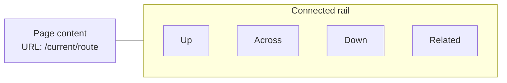
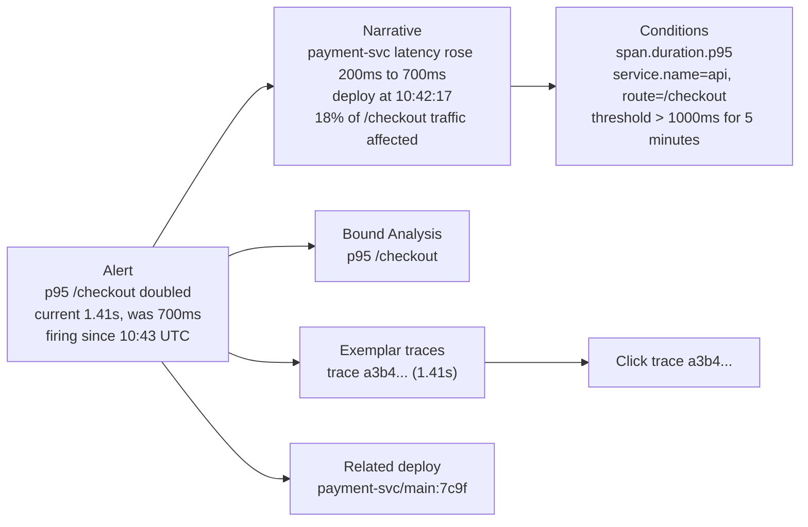
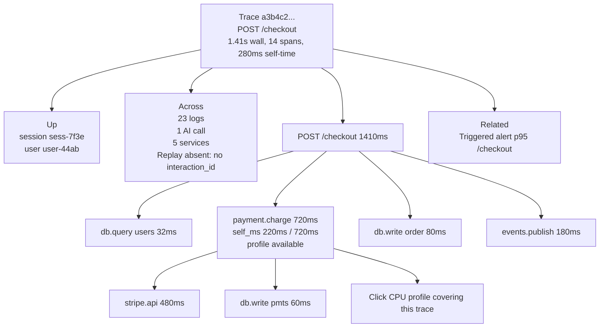
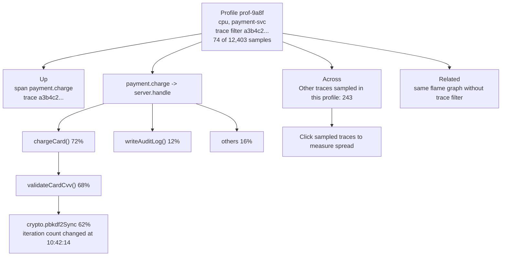
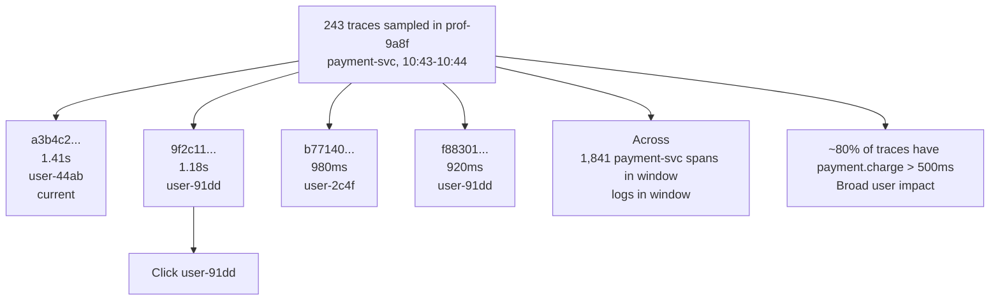
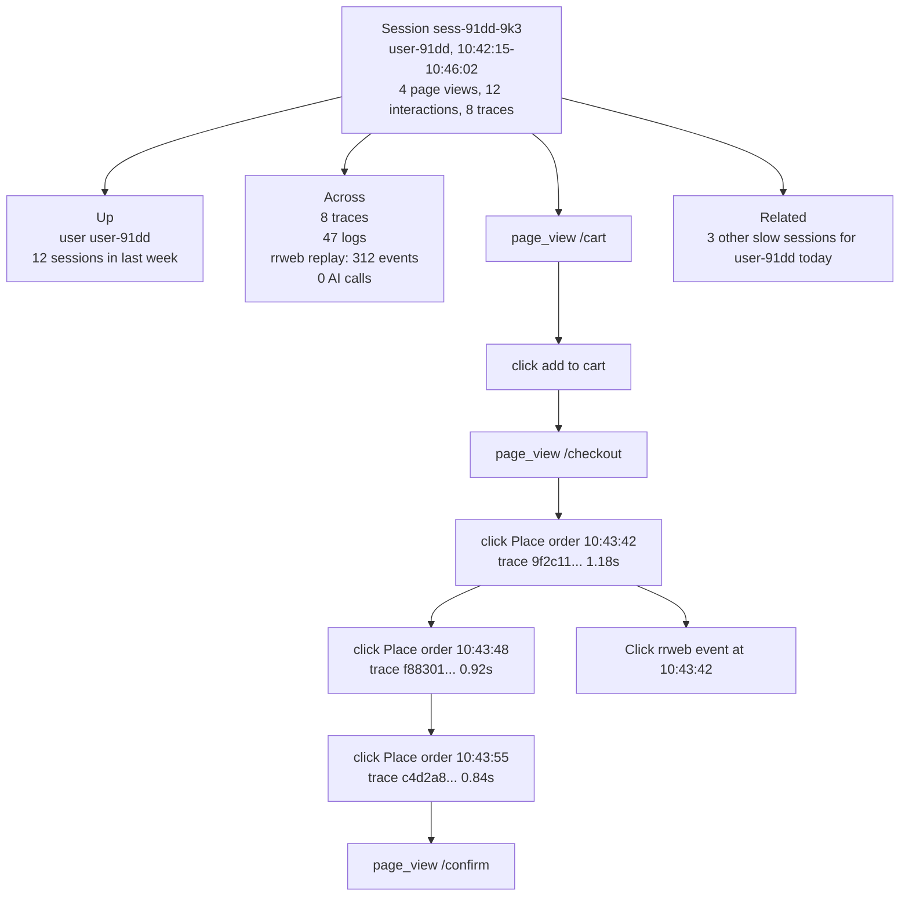
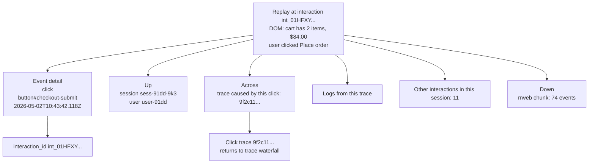
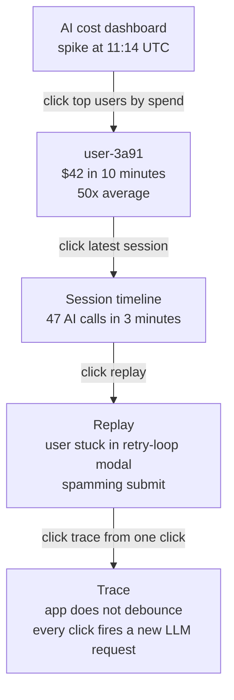
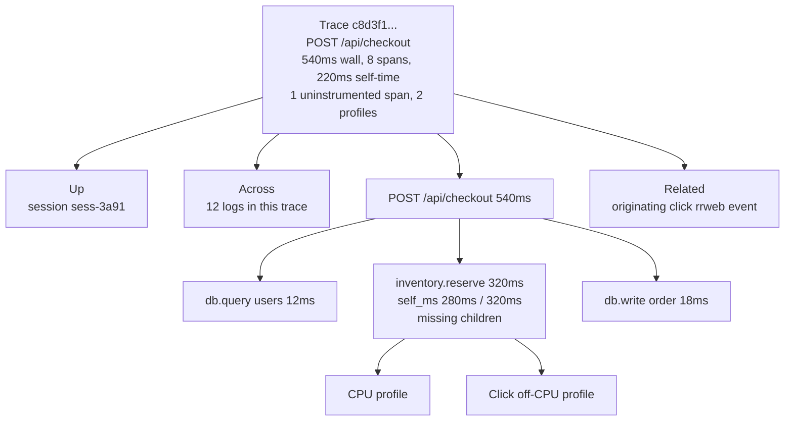
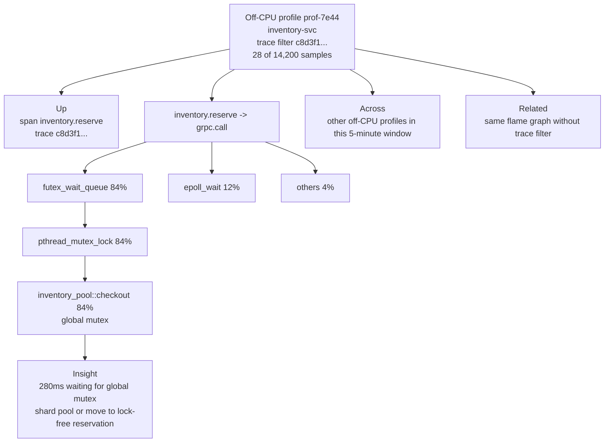

# Click to CPU — UX Spec

A worked example of drilling down across the unified-stack layers
([RFC 0003](../../rfcs/0003-unified-stack.md)) for one realistic incident. The
point is to make the **≤ 2 clicks to any neighbor** promise concrete: every
screen below shows the page state, the Connected rail, and exactly which click
moves the user forward.

This doc is illustrative, not normative — it is a target the RFCs should
satisfy, and a testable user journey to validate them against.

Layout convention used in the mockups:

The rail sits on every detail surface (RFC 0006). Empty sections render `—` with
a tooltip explaining why.

---

## Scenario A — Alert → root cause → user → fix

**Setup.** The on-call engineer's pager fires. An alert has triggered an
[RFC 0002 Stage 6](../../rfcs/0002-application-aware-analyses.md) Analysis-bound
notification: _"p95 /checkout doubled in last 8 min — payment-svc latency
200ms→700ms in same window — deploy at 10:42 to payment-svc/main:7c9f."_

The narrative lives in the alert payload. The on-call doesn't have to assemble
it.

### Step 1 — Open the alert

**RFCs exercised:** 0002 (narrative + alert binding), 0006 (connected rail).

### Step 2 — Trace waterfall

**Note:** "Replay — none (no interaction_id)" surfaces the honest empty state
from [RFC 0004](../../rfcs/0004-identity-propagation.md). This trace was a
server-side retry path, not driven by a browser click. The rail tells the user
_why_ the absence is informative.

**RFCs exercised:** 0005 (self-time + missing-instrumentation badge), 0007
(profile badge), 0006 (rail).

### Step 3 — Flame graph (scoped to this trace)

**RFCs exercised:** 0007 (flame graph + trace_id-scoped filter via
`profile_trace_index`), 0006.

### Step 4 — Cohort view: who else hit this?

**RFCs exercised:** 0007 (per-profile trace listing — phase 2), 0006.

### Step 5 — User session timeline

**RFCs exercised:** 0004 (session timeline grouped by `interaction_id`), 0006,
RFC 0002 Stage 6 (session-level analyses).

### Step 6 — Replay event detail

**RFCs exercised:** 0004 (interaction_id propagation closes the click→trace
loop), 0006.

### What just happened

The on-call engineer went **alert → trace → flame graph → cohort → session →
replay → trace** in 6 clicks. They saw:

- _that_ it's slow (alert + narrative — no thinking required)
- _which_ span is slow (trace waterfall)
- _which line of code_ is the cause (flame graph: pbkdf2)
- _how widespread_ the impact is (cohort)
- _what the user actually experienced_ (session timeline + replay)
- _and back to a trace_ — confirming the loop is fully closed

At every step the rail offered ≥ 3 navigation options. **No tab was a dead
end.** The fix is now obvious: the pbkdf2 config change at 10:42:14 set
iterations too high; revert it.

---

## Scenario B — LLM cost spike (briefer)

A different starting point exercising the same shape — proving the "any-to-any"
property.

5 clicks from cost dashboard to root cause. Same rail, different entry point.
The same identity skeleton (`user_id` → `session_id` → `interaction_id` →
`trace_id`) carries the journey.

---

## Scenario C — futex contention (eBPF)

Validates the kernel-level layer. A trace shows an unexplained 200ms pause
inside a span; the rail surfaces an off-CPU profile that explains it. **Requires
Phase 5 ebpf integration to be live.**

### Setup

A user reports the dashboard's `/api/checkout` endpoint is intermittently slow.
p95 has crept up but no service-level alert has fired.

### Step 1 — Trace waterfall, the suspicious span

### Step 2 — Off-CPU flame graph

### Step 3 — Confirming with concurrent traces

The rail shows "Other off-cpu profiles in this 5-min window." Clicking through
reveals the same `futex_wait_queue` pattern across 14 other in-flight
`inventory.reserve` spans during the slow period — confirming this is
contention, not a single-request anomaly.

### What this exercises

- **eBPF off-CPU profiling** (Phase 4 + 5): the kernel-level layer of the
  unified stack.
- **Profile→trace join** (`profile_trace_index`): scoping the flame graph to one
  trace's samples instead of fleet-wide.
- **The uninstrumented badge** (Phase 2.4): the original flag that pointed at
  `inventory.reserve` even before profiling was checked.
- **The connected rail's "Down" section**: surfacing both CPU and off-CPU
  profiles next to a span that has neither child spans nor in-process
  attribution.

### Status

**Currently aspirational.** The pieces are in flight:

- pprof ingest with `profile_type='offcpu'` ✅ (Phase 4.3)
- Trace→profile join + 🔥 badge ✅ (Phase 4.6)
- Off-CPU flame graph rendering ❌ (deferred with the rest of the flame-graph
  viewer; download via `?blob=true` and view in `pprof -http`)
- Beyla / OTel-eBPF-Profiler integration recipes ✅
  ([docs/howto/ebpf.md](../howto/ebpf.md))

When the dashboard's flame-graph viewer lands, this scenario runs end-to-end
against demo traffic. Until then, treat it as the design contract these RFCs
collectively make good on.

---

## The any-to-any matrix

The product test in RFC 0003: from any starting entity, every neighbor is
reachable in ≤ 2 clicks. Concretely:

| From ↓ / To → | Trace | Span | Log  | Replay | Session | User | AI call | Profile | Alert | Analysis |
| ------------- | ----- | ---- | ---- | ------ | ------- | ---- | ------- | ------- | ----- | -------- |
| **Trace**     | self  | ≤1   | ≤1   | ≤1 ✦   | ≤1 ✦    | ≤2   | ≤1      | ≤1 ✱    | ≤1 ◇  | ≤1 ◇     |
| **Span**      | ≤1    | self | ≤1   | ≤1 ✦   | ≤1 ✦    | ≤2   | ≤1      | ≤1 ✱    | ≤1 ◇  | ≤2       |
| **Log**       | ≤1    | ≤1   | self | ≤1 ✦   | ≤1 ✦    | ≤2   | ≤2      | ≤1 ✱    | ≤2    | ≤2       |
| **Replay**    | ≤1 ✦  | ≤2   | ≤2   | self   | ≤1      | ≤2   | ≤2      | n/a     | n/a   | n/a      |
| **Session**   | ≤1 ✦  | ≤2   | ≤1   | ≤1     | self    | ≤1   | ≤1      | n/a     | ≤2    | n/a      |
| **User**      | ≤2    | n/a  | n/a  | n/a    | ≤1      | self | n/a     | n/a     | n/a   | n/a      |
| **AI call**   | ≤1    | ≤1   | ≤2   | ≤1 ✦   | ≤1 ✦    | ≤2   | self    | n/a     | n/a   | n/a      |
| **Profile**   | ≤1 ✱  | ≤1 ✱ | ≤2   | n/a    | n/a     | n/a  | n/a     | self    | n/a   | n/a      |
| **Alert**     | ≤1 ◇  | ≤2   | ≤2   | ≤2 ✦   | ≤2 ✦    | ≤2   | n/a     | ≤2 ✱    | self  | ≤1 ◇     |
| **Analysis**  | ≤1    | ≤2   | ≤2   | n/a    | n/a     | n/a  | n/a     | n/a     | ≤1 ◇  | self     |

Legend:

- **≤1** — directly on the rail.
- **≤2** — via an intermediate detail (e.g. Replay → Session → User).
- **n/a** — no meaningful join (e.g. Profile → User isn't a question this
  product answers).
- **✦** requires RFC 0004 (`interaction_id` is needed for Replay-side joins to
  be exact rather than timestamp-approximate).
- **✱** requires RFC 0007 (profile entity exists).
- **◇** requires RFC 0002 Stage 6 (alert-binds-Analysis-binds-trace plumbing
  already shipped).

This matrix is the testable contract. The Connected rail (RFC 0006)
implementation should be reviewed against it: any cell marked ≤1 that requires a
click into a list view first is a bug.

---

## Implementation implications

What this UX spec implies for each RFC, beyond what's written:

### RFC 0004 (Identity propagation)

- Rail's "Trace caused by this click" link in Step 6 is the headline outcome.
  Without `interaction_id`, the link is absent or guessed. The spec says we
  never guess.
- Step 5's grouping of usage events by `interaction_id` is a UX detail not
  currently captured in the RFC's acceptance — worth adding: _"Session timeline
  groups usage events under their interaction_id and shows the resulting trace
  inline."_

### RFC 0005 (Self-time)

- The "⚠ payment.charge — self_ms 220ms / 720ms (30%)" surface in Step 2 is the
  per-trace summary header (already in RFC). Worth adding: the trace-level total
  ("self-time 280ms across 14 spans") is the trace-detail header line.

### RFC 0006 (Connected rail)

- Step 1 (alert detail) shows that the "Across" section can include an Analysis
  even though Analyses don't carry `trace_id` — they're related by topic, not
  identity. The rail's "related" section is broader than identity-graph; the RFC
  should formalize this.
- Step 4's "243 traces sampled in this profile" is a count link that opens a
  list, not a single navigation. Pattern worth documenting.
- "Empty section explanations" — Step 2's `Replay — none (no interaction_id)` is
  exactly the kind of _informative absence_ the rail RFC argues for. Worth
  promoting from open question to acceptance criterion.

### RFC 0007 (pprof)

- Step 3's filter `trace_id = a3b4c2…` against the in-browser pprof renderer:
  clientside filtering is fast for 50 KB blobs but worth confirming for 1 MB+
  profiles. If slow, the collector pre-filters by joining `profile_trace_index`
  and only returning matching samples.
- Step 4's "243 traces sampled in this profile" is the inverse query: given a
  profile, list traces. Already supported by `profile_trace_index`.

### RFC 0009 (eBPF bridge)

- Scenario A doesn't exercise eBPF. Scenario B's fix involves no kernel data
  either. eBPF mostly sharpens the _deepest_ layer — when a span is mysteriously
  slow with no obvious in-app explanation, off-CPU profiles or Beyla-derived
  edges close the gap.
- A third scenario worth adding later: a contention-on-a-shared-mutex incident
  where the in-app trace shows an unexplained 200ms pause and the off-CPU flame
  graph reveals the futex.

---

## How to use this doc

- **For reviewers**: read alongside the RFCs to verify each step's required
  behavior is explicitly specified.
- **For implementers**: each step is a candidate end-to-end test. The Connected
  rail's contract is what makes them mostly mechanical — once the rail's
  manifest endpoint returns the right neighbor set, the journey works.
- **For the comparison docs** (`docs/comparison/uptrace.md` and friends): this
  is the kind of journey we claim is one-tool. Worth linking from the comparison
  doc's "Where the delight lands" section so a reader can see the journey
  concretely.
