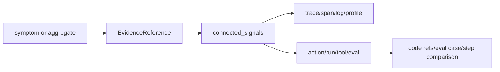

# @obsunified/mcp-server

Read-only investigation MCP server for AI agents that need access to an
obs-unified collector.

It exposes collector investigation endpoints as Model Context Protocol tools:
status, compact evidence bundles, evidence retrieval refs, recent traces, trace
detail, service operations, service map, logs, AI sessions, users, replays,
profiles, evaluations, connected signals, agent runs, actions, and tool calls.

The goal is agentic debugging, not raw telemetry dumping. Tools return stable
IDs and dashboard links so an agent can move from symptom to evidence to root
cause while keeping read access separate from write-only ingest credentials.
When collector responses include structured evidence references, agents should
prefer those references over parsing narrative text: use the entity kind, entity
ID, route, confidence, source, citations, and suggested pivots to decide the
next query. MCP tool responses include a `contract` block with the tool name,
params, return shape, and the published `EvidenceReference` JSON Schema version.
See [`docs/spec/evidence-reference.md`](../../docs/spec/evidence-reference.md).

This package is distinct from:

- SDK MCP context propagation helpers in `@obs-unified/telemetry-sdk/mcp`.
- Collector normalization of OpenTelemetry MCP span attributes such as
  `mcp.method.name`.

See [MCP in obs-unified](../../docs/mcp.md) for the terminology split.

## Investigation model

obs-unified exposes a connected telemetry graph. The MCP server lets an agent
walk that graph through read-only tools:


<details>
<summary>Mermaid source</summary>



</details>

Use `connected_signals` whenever one entity should lead to its neighbors. For
example:

- AI cost spike -> `ai_overview` -> expensive AI call/session ->
  `connected_signals` -> action/run/tool/eval context.
- User report -> `get_user` -> session/replay/usage anchor ->
  `connected_signals` -> traces, logs, AI calls, and actions.
- Slow trace -> `get_trace` -> hot span -> `connected_signals` -> profile,
  `get_profile`, instrumentation-gap evidence, logs, and action context.
- Tool incident -> `get_tool_call` or `get_action` -> side-effect evidence,
  `get_eval`, traces, and related agent run.

Treat confidence as part of the result. Explicit action IDs are stronger
evidence. Fallback-derived IDs are still useful for navigation, but they should
be reported as inferred rather than definitive.

## Evidence Bundle Workflow

For RFC 0011 investigations, prefer progressive disclosure:

1. Start with `get_evidence_bundle` for a compact, cited view of the anchor.
2. Read `findings`, `derivedSummaries`, `evidenceReferences`, `compactions`,
   `retrievalRefs`, and `suggestedNextPivots`.
3. Use `retrieve_evidence_ref` only when the compact bundle is insufficient.
4. Use `search_evidence_ref` when a retrieval ref points to a large raw log
   slice.
5. Use `get_evidence_stats` or the dashboard Evidence tab to inspect which
   issued refs agents expand most often.

Supported bundle anchors:

- `trace` — critical path, failed spans, correlated log exemplars, trace/log
  retrieval refs, and trace-linked profile refs.
- `action` — causal path, side-effect metadata, approval state, connected
  traces/logs/evals, AI calls, replay event windows, and profile pivots.
- `agent_run` — run timeline, tool/eval summary, cost/model metadata, AI calls,
  replay event windows, and connected traces/logs/profiles.
- `tool_call` — side-effect and approval state, result/error metadata, redacted
  args/results, connected action/run/eval context, and trace/log/profile pivots.

Retrieval ref expansion is project-scoped. AI-call refs return model, token,
cost, latency, and error metadata while keeping raw request/response payloads
redacted. Tool-call refs return hashes plus redacted args/results and audit or
mutation metadata when captured. Replay event-window refs return bounded chunks
with `chunkOffset` pagination, and profile frame refs decode stored pprof blobs
into bounded hot-frame summaries only when explicitly retrieved.

Bundle results preserve `EvidenceReference` v1 and add sibling RFC 0011
contracts: `EvidenceBundle`, `EvidenceRetrievalRef`, and `EvidenceCompaction`.
Collector deployments with migration `040_evidence_retrieval_refs` materialize
issued refs and record successful ref expansion/search telemetry.

## Install

```bash
pnpm add -g @obsunified/mcp-server
```

The package publishes to the public npm registry.

## Configure

Set the collector URL and one auth method:

```bash
export OBS_COLLECTOR_URL="https://obs.example.com"
export OBS_DASHBOARD_TOKEN="..."
```

Supported auth variables, in priority order:

- `OBS_DASHBOARD_TOKEN` — programmatic dashboard token, sent as a bearer token.
- `OBS_INGEST_KEY` — project ingest key, sent as a bearer token for collectors
  that allow it on read endpoints.
- `OBS_SESSION_COOKIE` — dashboard `obs_session` cookie value for ad-hoc local
  use.

Optional variables:

- `OBS_PROJECT_ID` — sent as `X-Project-Id` for multi-project collectors.
- `OBS_DASHBOARD_URL` — used to include dashboard deep links in tool responses.
- `OBS_MCP_TIMEOUT_MS` — request timeout in milliseconds. Defaults to `30000`.

## Claude Desktop / compatible local MCP host

```json
{
  "mcpServers": {
    "obs-unified": {
      "command": "obs-unified-mcp",
      "env": {
        "OBS_COLLECTOR_URL": "https://obs.example.com",
        "OBS_DASHBOARD_TOKEN": "..."
      }
    }
  }
}
```

For local development from this repo:

```json
{
  "mcpServers": {
    "obs-unified": {
      "command": "pnpm",
      "args": ["--dir", "/absolute/path/to/obs-unified", "--filter", "@obsunified/mcp-server", "start"],
      "env": {
        "OBS_COLLECTOR_URL": "http://localhost:8790",
        "OBS_INGEST_KEY": "dev-ingest-key"
      }
    }
  }
}
```

Build the package first with `pnpm --filter @obsunified/mcp-server build`.

## Tools

- `obs_status`
- `get_evidence_bundle` — return compact evidence for a `trace`, `action`,
  `agent_run`, or `tool_call` anchor, investigation intent, and token budget.
- `retrieve_evidence_ref` — expand a bundle retrieval ref into raw,
  less-compacted, or redacted metadata records. `chunkOffset` paginates replay
  event-window refs.
- `search_evidence_ref` — search within a log retrieval ref without expanding
  the full evidence slice.
- `get_evidence_stats` — return issued/expanded evidence-ref telemetry for the
  active project.
- `recent_traces`
- `get_trace`
- `service_operations`
- `service_map`
- `search_logs`
- `ai_overview`
- `get_ai_session`
- `get_user`
- `get_replay`
- `get_profile`
- `get_eval`
- `connected_signals`
- `get_agent_run`
- `get_action`
- `get_tool_call`

## Reporting guidance for agents

When returning an investigation to a user, summarize:

1. The starting symptom and time window.
2. The evidence path followed, including stable entity IDs.
3. Which links were explicit versus fallback-derived.
4. The likely root cause and the next concrete pivot or fix surface.
5. Dashboard deep links so a human can inspect the same graph.

This is a stdio MCP server. It writes operational errors to stderr only, because
stdout is reserved for JSON-RPC messages.
