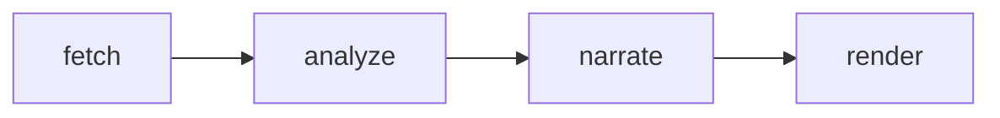
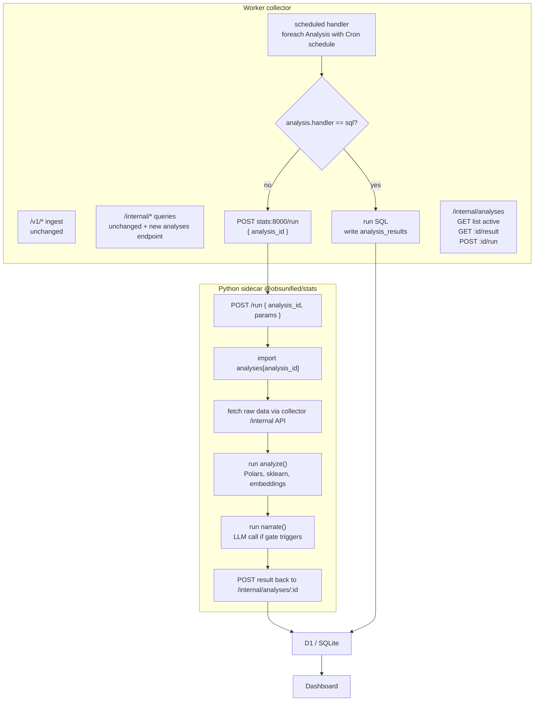
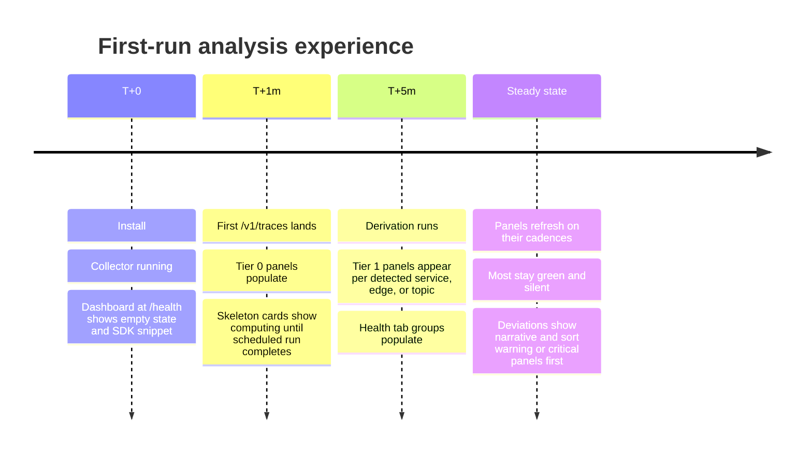
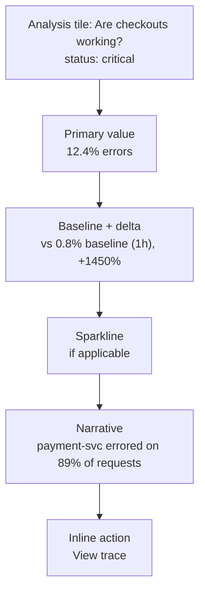
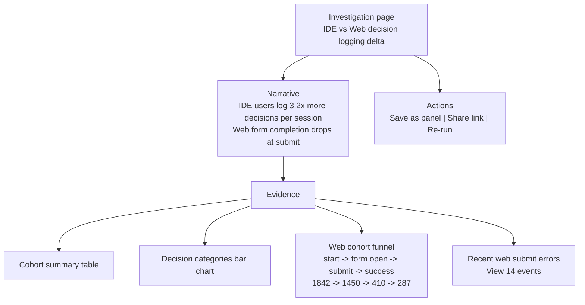

# RFC 0002: Application-aware Analyses

- **Status:** Draft
- **Author:** @sawanruparel
- **Created:** 2026-04-26
- **Updated:** 2026-04-26
- **Target:** `@obsunified/collector`, `@obsunified/dashboard`, new
  `@obsunified/stats` (Python sidecar)

## Summary

Replace the generic Traces/Logs/Metrics tabs as the _primary_ surface with a
unified **Analysis** abstraction that produces application-aware answers — a
status, a primary value, a comparison, and (optionally) a sentence-level
narrative — on either a schedule or on demand. Both "dashboard panels" and
"investigations" collapse into the same primitive. Generic signal tabs remain as
the power-user escape hatch but stop being where most users start.

The thesis: **the unit of value is an answer, not a query**. Existing
observability platforms ship primitives and assume users can synthesize. Most
can't or won't, and the AI assistants those platforms are now retrofitting
(Honeycomb Query Assistant, Datadog Bits, NewRelic Grok) are an admission that
the underlying UX is wrong. We have an opening to make answers the _default_,
not the bolt-on.

## Motivation

Three observations from working with the existing dashboard against the OTel
Astronomy Shop:

1. **Generic dashboards make users do the synthesis.** "p95 is 1.4s on POST
   /checkout" is data, not an answer. The actually useful framing is "p95
   doubled in the last 8 minutes; payment-svc went from 200ms to 700ms; there
   was a deploy at 10:42." Every existing platform forces the user to chain
   queries to get there.
2. **The application is unknown ahead of time.** We can't ship a "shopping
   template" because installs are self-hosted single-tenant against unknown
   apps. We have to _infer_ the shape from incoming telemetry.
3. **Some questions can't be panels.** "Why are users who log decisions in the
   IDE different from users who log them in the web?" is multi-step, narrative,
   and one-off. It needs cohort joins, decision-text categorization (probably
   embeddings or LLM zero-shot), and a synthesized explanation. SQL alone can't
   produce that. It's a notebook-shaped problem.

The current architecture handles none of this well:

- Panels don't exist as a first-class concept. Each dashboard recomputes its own
  queries on render.
- There's no narrative layer. Every tab shows numbers and asks the user to
  interpret them.
- There's no place to put a "why is X different from Y" investigation that isn't
  a one-off SQL session in the wrangler shell.

This RFC proposes a single primitive (Analysis) and a runtime that handles all
three cases — panels, investigations, alerts — without the UX pretending they're
different.

## Non-goals

Explicitly out of scope for this RFC:

- **Multi-tenant SaaS-shape scaling.** We're optimized for self-hosted
  single-tenant. Wide-multi-tenant (Datadog-shape) requires storage decisions
  (ClickHouse, etc.) that are the subject of a separate RFC.
- **Replacing D1 as the storage engine.** D1 + the indices landed in `7577b14`
  are sufficient until we cross ~100M hot rows. ClickHouse vs
  DuckDB-vs-staying-on-D1 is a separate decision, deferred.
- **Replacing the SDKs.** This RFC affects the collector and dashboard only.
  Backend (`@obsunified/telemetry-sdk`) and frontend
  (`@obsunified/analytics-sdk`) SDKs are unaffected.
- **Killing the generic tabs.** Traces / Logs / Metrics / Service Map remain for
  power users. They become "raw signal" tabs, not the front door.
- **Auto-remediation.** This RFC stops at "tell the user what's happening," not
  "fix it." A future RFC could explore action recommendation.

## Proposed design

### The Analysis abstraction

Every Analysis has the same lifecycle:



The differences between a panel, an investigation, and an alert are _properties_
of an Analysis, not different runtimes:

```python
class Analysis:
    id: str
    title: str
    schedule: Cron | OnDemand | Both
    fetch:    SqlQuery | MultiQuery | Callable
    analyze:  Callable | None       # Polars / sklearn / your own
    narrate:  NarrativeSpec | None  # LLM prompt + gating predicate
    view:     "tile" | "page" | "alert"
    group:    str                   # for tab/section assignment
    source:   "tier0" | "tier1" | "user" | "llm-suggested"
```

**Three sample Analyses** showing how the same shape covers different uses:

```python
# Simple panel — SQL-only, no narrative
checkout_error_rate = Analysis(
    id="service_error_rate::checkout",
    title="Checkout — error rate",
    schedule=Cron("*/1 * * * *"),
    fetch=Sql("""
        WITH now AS (...),
             base AS (...)
        SELECT now.error_rate, base.error_rate, ...
    """),
    view="tile",
    group="Health",
)

# Smart panel — multi-query + analysis + gated narrative
checkout_health = Analysis(
    id="checkout_health",
    title="Are checkouts working?",
    schedule=Cron("*/1 * * * *"),
    fetch=MultiQuery([
        ("now",      "SELECT ... last 5min ..."),
        ("baseline", "SELECT ... trailing 1h ..."),
        ("contributors", "SELECT ... per peer.service ..."),
    ]),
    analyze=detect_change_pattern,  # changepoint vs noise vs trend
    narrate=NarrativeSpec(
        prompt="Explain in one sentence what's happening with checkout.",
        only_when="status_changed_or_delta_pct>10",
    ),
    view="tile",
    group="Order flow",
)

# Investigation — on-demand, full stack
ide_vs_web_decisions = Analysis(
    id="ide_vs_web_decisions",
    title="IDE vs Web — decision logging delta",
    schedule=OnDemand,
    fetch=MultiQuery([
        ("ide_users", "..."),
        ("web_users", "..."),
        ("ide_decisions", "..."),
        ("web_decisions", "..."),
        ("web_funnel_events", "..."),
    ]),
    analyze=cohort_compare_with_categorization,
    narrate=NarrativeSpec(
        prompt="Explain the delta between cohorts and propose root causes.",
        only_when="always",
    ),
    view="page",
    group="Investigate",
)
```

The runtime treats all three identically. The dashboard renders each according
to `view`. The scheduler runs `Cron` ones on interval, `OnDemand` ones when
triggered.

### Where each Analysis runs

We need two runtimes, distinguished by capability:

- **Worker (existing collector).** Handles Analyses where `analyze is None` and
  `narrate is None` — i.e., pure SQL. This is the majority. The scheduled
  handler that already exists for retention cleanup picks up panel work.
- **Python sidecar (new `@obsunified/stats`).** Handles Analyses with `analyze`
  or `narrate`. Runs Polars / scikit-learn / sentence-transformers / LLM calls.
  Probably FastAPI + Marimo, with each Analysis as a Python file exporting
  `def run(params) -> AnalysisResult`.



The Worker doesn't need to know what language ran the Analysis. It just knows
"the result was written" and renders it.

### Storage

A single new table in D1, columns chosen to support both panels (where "latest"
matters) and investigations (where each run might be saved separately):

```sql
CREATE TABLE analysis_results (
  id INTEGER PRIMARY KEY AUTOINCREMENT,
  project_id TEXT NOT NULL,
  analysis_id TEXT NOT NULL,
  generated_at INTEGER NOT NULL,            -- unix ms
  params_hash TEXT,                         -- for OnDemand runs with custom params
  status TEXT,                              -- 'ok' | 'warn' | 'critical' | 'unknown'
  primary_value REAL,                       -- the headline number
  baseline_value REAL,                      -- the comparison number, if any
  delta_pct REAL,                           -- precomputed for filtering
  payload_json TEXT NOT NULL,               -- structured result (charts, tables, evidence)
  narrative TEXT,                           -- the sentence(s), or NULL if gate skipped
  narrative_signature TEXT,                 -- hash of narrative inputs, for cache invalidation
  duration_ms INTEGER,                      -- analysis runtime, for ops
  expires_at INTEGER NOT NULL               -- TTL via existing retention cron
);

CREATE INDEX idx_analysis_results_latest
  ON analysis_results (project_id, analysis_id, generated_at DESC);
```

Dashboard reads:

```sql
SELECT * FROM analysis_results
WHERE project_id = ? AND analysis_id = ?
ORDER BY generated_at DESC LIMIT 1
```

That's the panel render path. <50ms regardless of how heavy the original
Analysis was.

### Derivation engine — panels without templates

Because we don't know the application ahead of time, panels are _derived from
the observed telemetry shape_, not pre-canned. Three tiers:

**Tier 0 — universal** (apply to any install, unconditional):

- overall error rate now vs trailing baseline
- top error spikes by service
- p95 latency per service today vs same hour yesterday
- active sessions (when frontend SDK is wired)
- throughput slope — "do we need to scale?"

**Tier 1 — pattern-detected** (auto-derived from shape):

- per service in `service.name` → `service_error_rate::{svc}`
- per cross-service edge in service-map → `dependency_health::{src}->{tgt}`
- per `messaging.destination` topic → `messaging_lag::{topic}`
- per top-N high-volume route → `endpoint_breakdown::{route}`
- if any LLM-kind spans → `ai_cost_burn`, `ai_error_rate`
- if any `/v1/usage` events → `active_sessions`, `funnel`s

**Tier 2 — user / LLM defined** (the long tail):

- user adds a custom Analysis via UI or YAML
- Ask box generates one and persists it on user save

The derivation runs periodically (every ~5 minutes) and updates the active
Analysis set. New service shows up at noon → its panels appear by 12:05 without
anyone configuring anything.

```python
def derive_analyses(shape: TelemetryShape) -> list[Analysis]:
    out = []

    # Tier 0
    out.extend(UNIVERSAL_ANALYSES)

    # Tier 1
    for svc in shape.services:
        out.append(make_service_error_rate(svc))
        out.append(make_service_latency_p95(svc))

    for edge in shape.cross_service_edges:
        out.append(make_dependency_health(edge.source, edge.target))

    for topic in shape.messaging_destinations:
        out.append(make_messaging_lag(topic))

    if shape.has_llm_spans:
        out.append(AI_COST_BURN)
        out.append(AI_ERROR_RATE)

    return out + load_user_defined_analyses()
```

`TelemetryShape` is itself the result of a cheap query that runs every 5 minutes
and is cached:

```sql
SELECT
  service_name,
  COUNT(DISTINCT trace_id) AS traces,
  EXISTS (SELECT 1 FROM telemetry_spans WHERE service_name = svc.service_name
          AND attributes_json LIKE '%openinference.span.kind%LLM%') AS has_llm,
  ...
FROM telemetry_spans svc
WHERE received_at >= datetime('now', '-1 hour')
GROUP BY service_name
```

### The narrate gate

This is the single most important decision in the RFC.

**Naive approach:** every Analysis with `narrate` defined produces a narrative
on every run. At 10 panels × 60 runs/hour × $0.001/LLM-call = ~$15/day/project.
More importantly: 600 sentences/hour is **noise**, not signal. Users will stop
reading.

**Real approach:** narrative is _gated_. The gate is a predicate over the
analysis output. Only generate narrative when the gate triggers; otherwise reuse
the previous narrative or omit it.

```python
NarrativeSpec(
    prompt="Explain in one sentence what's happening with checkout.",
    only_when="status_changed_or_delta_pct>10",
)
```

The gate predicate language supports:

- `status_changed` — status moved between {ok, warn, critical}
- `delta_pct>N` — primary value changed by >N% vs baseline
- `signature_changed` — hash of structured findings differs from previous
- `always` — never gate (investigations want this)
- `never` — never narrate (pure-data panels)
- compound: `&&`, `||`

Implementation:

```python
def should_narrate(analysis, current_result, previous_result) -> bool:
    spec = analysis.narrate
    if spec is None or spec.only_when == "never":
        return False
    if spec.only_when == "always" or previous_result is None:
        return True
    return evaluate_predicate(spec.only_when, current_result, previous_result)
```

When the gate doesn't trigger, the previous narrative is reused (rendered with a
"(unchanged for 8 min)" affordance) or hidden.

**Net effect at 10 panels:** narrative fires maybe 2–5 times/hour in steady
state, 20–50 times/hour during an incident. Annual LLM cost falls from "real
money" to "rounding error," and the dashboard goes silent unless something is
worth saying.

### Dashboard surface

Three default tabs replace the current Traces/Logs/Metrics-first nav:

| Tab             | Contents                                                                                               | Source                        |
| --------------- | ------------------------------------------------------------------------------------------------------ | ----------------------------- |
| **Health**      | Tier 0 + Tier 1 derived panels grouped by capability (Services / Dependencies / Async / AI / Frontend) | Derivation engine             |
| **Investigate** | List of available investigation templates + saved investigation runs                                   | Tier 2 (user) + LLM-suggested |
| **Ask**         | Free-form Q&A box that maps natural language to an Analysis (existing or generated)                    | LLM router                    |

The existing Traces, Logs, Service Map, AI Calls tabs move to a "Raw" section,
accessible from the rail's bottom (or via ⌘K). They remain the source of truth
for power-user investigation.

### What an Analysis file actually looks like

For SQL-only Analyses (Tier 0/1 majority), they're TypeScript modules in the
collector:

```ts
// packages/obs-collector/src/analyses/service_error_rate.ts
export const serviceErrorRate = (service: string): Analysis => ({
  id: `service_error_rate::${service}`,
  title: `${service} — error rate`,
  schedule: cron("*/1 * * * *"),
  group: "Services",
  fetch: sql`
    WITH now AS (...),
         base AS (...)
    SELECT ...
  `,
  view: "tile",
  source: "tier1",
});
```

For Analyses with `analyze` or `narrate`, they're Python files in the sidecar:

```python
# stats/analyses/checkout_health.py
from obs_stats import Analysis, fetch_via_collector, llm

def run(params):
    data = fetch_via_collector(MULTI_QUERIES, params)
    pattern = detect_change_pattern(data)  # changepoint, trend, noise

    if not should_narrate(pattern, params.previous):
        return AnalysisResult(
            status=pattern.status,
            primary=pattern.current_value,
            baseline=pattern.baseline_value,
            delta_pct=pattern.delta_pct,
            payload=pattern.evidence,
            narrative=None,  # gate skipped
        )

    narrative = llm.complete(
        prompt=NARRATIVE_PROMPT,
        context={"pattern": pattern, "evidence": data},
    )
    return AnalysisResult(..., narrative=narrative)
```

Both registration paths feed the same `analysis_results` table.

## UX & visual design

The architecture is one half of the work; how the user experiences it is the
other. This section describes the surfaces concretely so we don't ship the right
plumbing into a useless interface.

### First-run journey

The whole proposition is "open the dashboard, see answers." That has to be true
before any user customization. The default progression on a fresh install:



The empty state does _not_ show a generic "no data yet" — it shows exactly what
the user needs to do to make data flow, with one-click copy of the SDK snippet
for the project's ingest key.

### Status hierarchy and visual treatment

Four states, each with a distinct visual cue in our existing palette:

| Status     | Color                           | When                                                                                      |
| ---------- | ------------------------------- | ----------------------------------------------------------------------------------------- |
| `unknown`  | `outline-soft` (grey)           | No data in window, or analyzer hasn't run yet                                             |
| `ok`       | `primary` (green, low-emphasis) | Within baseline thresholds                                                                |
| `warn`     | `warning` (amber)               | Deviation noticed but not critical (delta_pct in 10–25%, or status in {1, 2} of 3 layers) |
| `critical` | `error` (red, pulse animation)  | Significant deviation or hard failure                                                     |

Reuses the `Tag` primitive from `packages/dashboard/src/components/Tag.tsx`. No
new color tokens. Pulse animation only on `critical`, only on the panel header —
the body stays still so users can read it.

### Panel layout — `view: "tile"`

Default panel size is 1 column (~280px wide). Two-column variant
(`size: "wide"`) for panels that benefit from more space (sparklines,
multi-series compare). Panels never grow taller than ~140px in the grid.



Panels with `narrate: None` or gate-skipped renders simply omit the narrative
line. Panels in `ok` state collapse the narrative line entirely (no whitespace).
The card shrinks to ~100px in steady state, ~140px when narrative + sparkline
are both present.

Click anywhere on a tile → opens the corresponding investigation page if one
exists, otherwise opens the relevant raw-signal view (Traces filtered by the
Analysis's scope) as a fallback.

### Investigation layout — `view: "page"`

Investigations are full-width pages, not tiles. Three sections, top to bottom:



The narrative is the lede. Evidence is below for users who want to verify.
Investigations have a permalink (`/#/investigate/:id?run=:n`) so they can be
shared mid-incident.

"Save as panel" is the magic — it converts an OnDemand Analysis into a Cron one
with the same params, dropping the result into the user's Health tab.

### Narrative rendering rules

The whole UX hinges on narratives feeling like _useful sentences_ rather than
chatbot noise. Three rules:

1. **Narratives never start with "I" or "Here's".** They're declarative
   statements about the system, not a chatbot speaking. Prompt templates enforce
   this.
2. **Always cite.** A narrative that mentions "the trace" must include an inline
   `→ trace_id[:8]…` link. Prompt scaffolding injects available
   traceIds/spanIds/timestamps for the LLM to choose from; if it can't produce a
   citation, the gate suppresses the narrative.
3. **Include time anchor.** "starting 8 min ago", "since 14:32", "for the past 6
   hours" — gives users a fast sense of urgency.

Rendering treatment: narratives sit on a left-border accent in the panel's
status color (`error` for critical, `warning` for warn). No quotes, no chat
bubbles, no avatars. They're statements, not messages.

### Discovery at scale

A live install on the OTel demo derives ~25 Tier 1 panels. A real production
install could hit hundreds. The Health tab needs filtering and grouping rules so
users aren't overwhelmed:

- **Default view:** group by capability (Services / Dependencies / Async / AI /
  Frontend), `ok`-status panels collapsed into a compact summary ("12 services
  healthy"), `warn`/`critical` panels promoted to the top.
- **"Focus mode" toggle in the header:** hide everything that's `ok`. Default-on
  if any `critical` exists; user-overridable.
- **Search box:** filter panels by title or scope (service name, route). Lives
  in the existing top-bar global search.
- **Group collapse:** click a group header to collapse the whole group. State
  persists per user in localStorage.

Power users can pin specific panels to a "Pinned" group at the top via
right-click. Pinned status persists per user.

### The Ask box

Lives in the global top bar (replaces or complements the existing command
palette). Two modes:

- **Quick ask** (single input): "is checkout slow?" → answer appears inline as a
  slide-down result card under the box. No tab change.
- **Full ask** (`/ask` route): conversational thread with follow-ups. Each turn
  shows narrative + cited evidence + a "Save as panel" button if the question
  warrants persistence.

Quick ask renders with progressive disclosure: narrative first, "Show the
queries I ran" expandable below for users who want to verify the reasoning. Same
pattern as Cursor's chat: trust by default, but verify on demand.

### Settings and customization

A new "Settings" section in the rail covers:

- **Narrative:** enable/disable globally, set per-project budget (max LLM
  calls/hour), pick the model (Haiku / Sonnet / Opus).
- **Panels:** view all derived panels with toggle to hide/show, edit custom
  Analyses (Tier 2), see refresh interval per panel.
- **Templates:** future home for "preset" Analysis sets if we ever ship them
  (deferred — derivation makes them mostly unnecessary).

Per-panel settings (refresh interval override, narrative on/off, status
threshold) live in a popover triggered from the panel's `⋯` menu.

### Mobile / narrow viewport

Health tab must work down to ~768px (tablet portrait). Below that, panels stack
to one column and the rail collapses to its 56px icon-only mode (behavior
already exists). Investigation pages reflow to single-column; evidence cards
stack vertically. Ask box becomes full-screen on narrow viewports.

### Loading and stale states

Three discrete states the UI distinguishes:

1. **Cached + fresh** (default, < refresh_interval old): full panel renders
   immediately.
2. **Cached + stale** (> refresh_interval since last run, but a result exists):
   panel renders with a faint "(updated 12 min ago)" subscript; re-run kicks off
   in background.
3. **No cached result yet** (first run, OnDemand never triggered): skeleton
   placeholder with `"computing..."` and the expected duration ("typically
   2–5s") if known.

The dashboard never blocks rendering on a fresh fetch. Stale-while-revalidate is
the rule.

### What gets shipped vs deferred per stage

| Stage   | UX deliverable                                                                     |
| ------- | ---------------------------------------------------------------------------------- |
| Stage 1 | Health tab, panel tile rendering (no narrative yet), default grouping, empty state |
| Stage 2 | (no new UX — under-the-hood analyze layer)                                         |
| Stage 3 | Narrative line in panel tiles, status pulse animation                              |
| Stage 4 | Investigation page rendering (`view: "page"`), Investigate tab                     |
| Stage 5 | Ask box (quick ask first, full thread later)                                       |
| Stage 6 | Settings section, focus mode, panel pinning                                        |

Each stage produces a screenshot-able artifact, so progress is visible even
before the full system is in place.

## Staging

Sequenced from "useful immediately" to "everything we discussed":

### Stage 1 — SQL-only panels in the existing Worker (≈1 week)

- New `analysis_results` table migration.
- TypeScript `Analysis` type + `runSqlAnalysis()` runner.
- Hook into existing `scheduled` handler — every minute, run any SQL-handled
  Analysis whose `last_run + interval < now`.
- Hardcode ~10 Tier 0 + simple Tier 1 Analyses (per-service error rate and
  latency for the OTel demo's services).
- Dashboard `Health` tab renders panels from `analysis_results`.

After Stage 1: every dashboard tab has data in <50ms regardless of D1 size. The
narrative is missing but the structure works.

### Stage 2 — Python sidecar + analyze layer (≈1 week)

- `@obsunified/stats` package: FastAPI + Polars, deployable as a sibling Worker
  _or_ a small VM (deferred).
- Define `analyze` adapter — Worker scheduled handler can dispatch to sidecar
  via HTTP.
- Two analyze primitives ported from the conversation:
  - `detect_change_pattern` (changepoint vs noise vs trend)
  - `cohort_compare_with_categorization`
- Update 3–4 panels to use them (e.g., `checkout_health`).

After Stage 2: panels can incorporate stats-shaped logic.

### Stage 3 — Narrate layer with gate (≈3 days)

- `NarrativeSpec` + gate predicate evaluator.
- Anthropic / OpenAI client adapter (whichever the user configures).
- Caching by `narrative_signature` so unchanged states don't re-pay.
- Dashboard renders narrative under each panel that has one.
- Per-project "narrative budget" config (max calls/hour) as a safety rail.

After Stage 3: dashboards begin "saying" things instead of just showing numbers,
but only when worth saying.

### Stage 4 — Investigations (≈1 week)

- `view: "page"` rendering in the dashboard.
- Three investigation templates implemented in the sidecar:
  - cohort comparison (covers IDE-vs-Web)
  - funnel drop attribution
  - anomaly summary ("what's different right now")
- Each investigation = one Python file with `run(params)` returning
  `AnalysisResult`.
- Saved investigations persist with their params snapshot.

After Stage 4: the IDE-vs-Web question can be asked and answered.

### Stage 5 — Ask box → LLM router (≈1 week)

- LLM tool-use loop:
  1. Receive user question.
  2. Plan: pick an Analysis template + fill params, OR generate ad-hoc SQL.
  3. Execute via the same runtime.
  4. Return narrative + evidence.
- "Save as panel" affordance — user can promote an answer to a recurring
  Analysis.

After Stage 5: the system answers free-form questions over the user's own
telemetry.

### Stage 6 (deferred) — Auto-pinning + alert binding

- Pin frequently-asked investigations as panels automatically.
- Bind alert rules to Analyses (existing alerts table → `analysis_id`).
- Slack/webhook notifications carry narrative, not just thresholds.

## Risks and tradeoffs

**Noise saturation.** The single biggest failure mode. If narratives fire too
often, users tune them out and we're worse than where we started. The gate
(`only_when`) is the mitigation. We will need to tune defaults empirically —
likely starting strict (`status_changed_or_delta_pct>20`) and loosening based on
usage.

**LLM cost.** Even with the gate, narratives at scale aren't free. We should
default to a cheap model (Haiku-class) for narrative and reserve larger models
for the Ask flow. Per-project budget caps are non-negotiable on Stage 3.

**Two runtimes to operate.** Worker + Python sidecar is a real complexity add
for a project that's currently a single Cloudflare deploy. Mitigations:

- Sidecar is optional. If only Stage 1 ships, no Python is needed.
- Sidecar is stateless (writes back to the collector). Easy to redeploy, easy to
  scale to zero.
- Could be hosted on `fly.io`, `Modal`, or even another Worker (using Pyodide)
  once Workers' Python support matures.

**Latency variance.** Investigations can take 5–20s. The dashboard needs to
handle this gracefully — show stale cached result, swap in fresh, never block.

**Analysis sprawl.** Once derivation auto-generates panels per service / edge /
topic, large installs could end up with hundreds of Analyses. The dashboard
needs filtering and grouping; the scheduler needs concurrency control.

**Security model for user-defined Analyses.** Tier 2 (user) Analyses run
arbitrary SQL or Python. SQL is sandboxed by D1. Python isn't — a user-defined
Analysis in the sidecar is effectively code execution. We should restrict Tier 2
in the sidecar to a constrained DSL initially, and only open up real Python
after a security pass.

## Open questions

1. **Marimo or FastAPI for the sidecar?** Marimo gives us reactive notebooks
   deployable as apps (and surfaces investigations naturally). FastAPI is
   simpler but less notebook-shaped. Probably worth a week-long spike.
2. **Where does the Ask LLM run?** Inside the Worker (cheap, CPU-limited) or the
   sidecar (more powerful, but adds latency)? Likely in the Worker for routing,
   sidecar for execution.
3. **How do we represent "narrative across multiple Analyses"?** During an
   incident, three correlated panels might warrant _one combined_ narrative
   ("checkout, payment, and shipping are all elevated — likely downstream to
   payment-svc"). Not Stage-1 work but the abstraction should leave room.
4. **Panel discoverability.** Auto-derived Tier 1 panels could overwhelm the
   dashboard. How do we surface only the "interesting" ones by default? Probably
   by hiding panels with `status: ok` and showing a compact summary.
5. **Backfilling on first install.** When the dashboard first loads, the Health
   tab will be empty until the scheduled handler runs. Should first-time
   Analysis runs trigger eagerly on install? On dashboard open?

## Alternatives considered

- **Don't unify panels and investigations.** Keep them as separate surfaces.
  Rejected — the conversation that produced this RFC established that the same
  lifecycle covers both, and unification enables "promote investigation to
  panel" without architectural work.

- **Templates per app type (shopping, AI, SaaS).** Initial direction; rejected
  because we don't know the app shape at install time. Replaced with derivation
  from telemetry shape.

- **Pure SQL panels with no narrative.** Cheaper. Rejected because the framing
  of this RFC is "answers, not data" — no narrative means we haven't moved the
  needle vs the existing dashboard.

- **Move D1 → ClickHouse first.** Rejected for now (separate RFC). The perf wins
  from the indices in `7577b14` give us runway. This RFC's goals are achievable
  on D1.

- **Polars/DuckDB as the storage engine.** Rejected — Polars is a query library,
  not a database. DuckDB is interesting but pre-mature; D1 is fine for
  self-hosted single-tenant at our scale. Polars stays in the toolbox for the
  sidecar's compute layer.

## Inspirations

This isn't a new idea, just a synthesis of patterns from products that each
handle one slice well:

- **Datadog Watchdog** — auto-detection of anomalies, narrative output
- **Honeycomb BubbleUp** — "what's different about this slice"
- **PostHog Max AI** — natural-language Q&A over product analytics
- **Grafana Asserts** — application-aware panels via inferred semantics
- **Sigma / Hex / Mode** — notebook-shaped data investigations
- **Marimo** — reactive Python notebooks deployable as apps
- **Sentry Issues** — answer ("here's what broke") not query interface

The bet: deliver this synthesis as the _primary_ surface, not a bolt-on, and
stay self-hosted single-tenant so we don't carry SaaS-shaped operational
baggage.

## Acceptance criteria

This RFC is "done" when the OTel demo, with no manual configuration beyond
`pnpm demo:up`, produces a Health tab where:

1. Tier 0 panels are populated within 60s of first traffic.
2. Tier 1 panels are derived per service (frontend, frontend-proxy, checkout,
   payment, etc.) within 5 minutes.
3. The IDE-vs-Web (or equivalent cohort comparison) investigation can be
   triggered manually and produces a narrative answer within 30s.
4. The Ask box answers "is checkout slow?" with a sentence that cites the
   supporting trace.
5. Narrative noise stays under 10 sentences/hour in steady state on the demo.

If those five hit, we've made answers the default surface.
