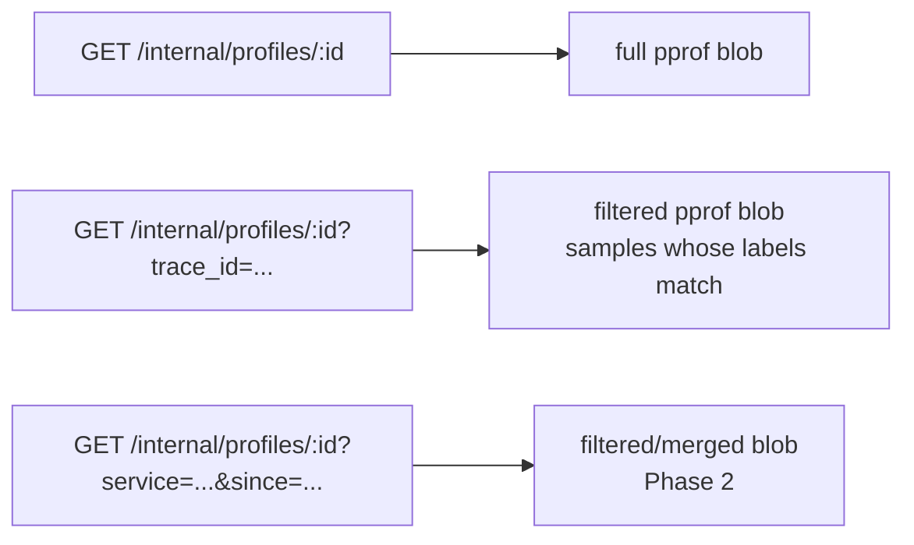

# RFC 0007: pprof profiling receiver

- **Status:** Draft
- **Author:** @sawanruparel
- **Created:** 2026-05-02
- **Updated:** 2026-05-03
- **Parent:** [RFC 0003 — Unified Stack](0003-unified-stack.md)
- **Benefits from (does not require):**
  [RFC 0004 — Identity propagation](0004-identity-propagation.md)
- **Companion:** [docs/ux/click-to-cpu.md](../docs/ux/click-to-cpu.md) Step 3
  (flame graph scoped to trace) and Step 4 (cohort view from a profile)
- **Target:** `@obsunified/collector`, `@obsunified/dashboard`,
  `@obsunified/telemetry-sdk`

## Summary

Add a profiling layer to obs-unified by accepting **pprof-format** profiles on a
new endpoint and storing them as blobs (R2 / filesystem) with a small metadata
index in SQLite. The wire format is the de-facto standard emitted by every
relevant agent (per-process: `@datadog/pprof`, Go's `runtime/pprof`, `py-spy`;
eBPF: Parca-Agent, OTel-eBPF-Profiler, Pyroscope-Agent). The dashboard renders
flame graphs in-browser from the blob, with a per-trace flame-graph badge on
slow spans (joined via `pprof_sample_label.trace_id`).

Profiling lands as **the deepest layer of an already-coherent chain** (RFC
0003), not as a new orphan tab. The Profiles surface is reachable from the
Connected rail (RFC 0006) on any trace or span; aggregate fleet views are a
separate, lower-priority Phase 2.

## Motivation

Spans answer "which service is slow"; profiles answer "which line of code is
expensive." Once spans carry CPU-time annotation (RFC 0005) the user can see
_that_ a span is compute-bound; the profile tells them _what_ to fix. This is
the only signal that meets that need cleanly.

Three constraints shape the design:

1. **We must not strain SQLite.** Stack-frame cardinality blows up row counts.
   We store pprof blobs in R2/filesystem and keep only a small metadata row per
   profile.
2. **We must accept profiles from any agent.** Per-process libraries for sandbox
   runtimes (Workers, Lambda); eBPF DaemonSets for k8s nodes. Both emit pprof.
   Same endpoint, same storage.
3. **We must connect to traces.** A flame graph next to a slow span in the trace
   waterfall is the headline UX. Without `pprof_sample_label.trace_id` the join
   is approximate (pid+ts), and we lose most of the value.

## Today

Profiling is **not present in any form**:

- No `/v1/profiles*` endpoint.
  ([metrics-receiver.ts](../packages/obs-collector/src/plugins/metrics-receiver.ts)
  is the only similarly-shaped plugin.)
- No `profile_*` tables.
- No flame-graph component in the dashboard.
- No pprof helpers in `@obsunified/telemetry-sdk`.

The closest neighbor is RFC 0005 (CPU-time on spans), which is a coarse proxy
but does not give function-level resolution.

## Proposed design

### Endpoint and format

`POST /v1/profiles/pprof` — accepts gzipped pprof protobuf. Auth: ingest API key
(same middleware as `/v1/traces`). Body limit: 4 MB (typical 60s pprof from Node
≈ 30-80 KB; JVM async-profiler ≈ 200-800 KB).

Headers we honor:

- `content-encoding: gzip`
- `x-obs-profile-type` — one of `cpu`, `heap`, `wall`, `block`, `mutex`,
  `goroutine`. The pprof format itself encodes sample types in the
  `Profile.sample_type` array, but agents differ in how they tag the _primary_
  type and we want a canonical answer without parsing. Header is authoritative
  when present; otherwise we pick
  `Profile.sample_type[Profile.default_sample_type]` (where
  `default_sample_type` is an _index_ into that array).
- `x-obs-service` — service name. Required when not derivable from sample
  labels. (pprof itself has no standard "service name" field; agents typically
  encode it as a label like `service` or `service.name` on each sample. Our
  extractor reads these label keys before falling back to the header.)

We deliberately serve a _separate_ path (`/v1/profiles/pprof`) instead of
squatting on the future OTLP `/v1/profiles`. When OTel profiles GAs, a follow-on
RFC adds `/v1/profiles` and routes to the same internal store.

### Storage

Blobs go to:

- **Cloudflare:** R2 bucket bound as `PROFILES_BUCKET` (added to
  [framework/env.ts](../packages/obs-collector/src/framework/env.ts) alongside
  the existing `REPLAYS_BUCKET?: R2Bucket`). Key shape:
  `{project_id}/{ts}/{profile_id}.pprof.gz`. Same `.put(...)` pattern as
  [replay-receiver.ts:16-37](../packages/obs-collector/src/plugins/replay-receiver.ts)
  — see that plugin for the canonical write-blob-then-record-metadata flow we
  mirror here.
- **Generic / Node:** filesystem under
  `${PROFILE_BLOB_DIR}/{project_id}/{yyyymmdd}/{profile_id}.pprof.gz`.

Metadata in SQLite (migration `028_profile_blobs.sql` — the next free number
after `026`; RFC 0004 takes `027`; RFC 0005 introduces no migration):

```sql
CREATE TABLE IF NOT EXISTS profile_blobs (
  id TEXT PRIMARY KEY,                    -- ULID
  project_id TEXT NOT NULL,
  service_name TEXT,
  profile_type TEXT NOT NULL,             -- 'cpu' | 'heap' | 'wall' | 'block' | 'mutex' | 'goroutine'
  start_ts TEXT NOT NULL,                 -- ISO8601 — beginning of the sampled window
  end_ts TEXT NOT NULL,
  duration_ms INTEGER NOT NULL,
  blob_size_bytes INTEGER NOT NULL,
  blob_url TEXT NOT NULL,                 -- R2 key or fs path
  sample_count INTEGER,                   -- total samples in the profile (for sanity)
  agent TEXT,                             -- 'datadog-pprof' | 'pyroscope' | 'parca-agent' | 'otel-ebpf' | unknown
  resource_attrs_json TEXT,
  received_at TEXT NOT NULL,
  expires_at TEXT NOT NULL
);

CREATE INDEX IF NOT EXISTS idx_profile_blobs_service_ts
  ON profile_blobs (project_id, service_name, end_ts DESC);

CREATE INDEX IF NOT EXISTS idx_profile_blobs_expires
  ON profile_blobs (expires_at);

-- Trace→profile join table. One row per (profile, trace) pair, populated at
-- ingest by parsing the pprof and reading sample labels.
CREATE TABLE IF NOT EXISTS profile_trace_index (
  profile_id TEXT NOT NULL,
  trace_id TEXT NOT NULL,
  project_id TEXT NOT NULL,               -- denormalized for retention sweep
  PRIMARY KEY (profile_id, trace_id),
  FOREIGN KEY (profile_id) REFERENCES profile_blobs(id) ON DELETE CASCADE
);

CREATE INDEX IF NOT EXISTS idx_profile_trace_index_trace
  ON profile_trace_index (project_id, trace_id);
```

We use a join table from the start instead of `trace_ids_json`. The earlier
"JSON array of trace_ids" approach failed in two ways: (1) high-traffic services
touch thousands of distinct traces in a 60s profile, blowing past D1's 2 MB row
limit; (2) `WHERE json_each(...) = ?` is a non-portable SQLite-ism and conflicts
with [RFC 0008](0008-storage-interface.md)'s storage-interface goals. The join
table is one row per `(profile, trace)` pair (ULID + 32-char trace_id ≈ 50
bytes), trivially indexed, and translates cleanly to any future engine.

For a 60s CPU profile capturing 5,000 distinct traces (a hot service): ~250 KB
of join-table rows, indexed for sub-ms lookup. Acceptable.

### Trace → profile join

Given a `trace_id`, find the profile(s) that sampled it:

```sql
SELECT b.id, b.profile_type, b.start_ts, b.end_ts, b.blob_url
FROM profile_trace_index i
JOIN profile_blobs b ON b.id = i.profile_id
WHERE i.project_id = ?
  AND i.trace_id = ?
ORDER BY b.end_ts DESC;
```

Indexed lookup, no scan. A span detail in TelemetryDashboard shows a "🔥
Profile" badge when this returns ≥ 1 row. Click → flame graph rendered
client-side, scoped to that trace_id.

### Flame graph rendering

Two paths depending on profile size, with a single endpoint shape:



**Client-side path (default).** For blobs ≤ 500 KB, fetch the full blob, parse
with [`pprof-format`](https://www.npmjs.com/package/pprof-format) in the
browser, optionally filter to a trace_id, aggregate stacks, render a flame graph
(~200 LOC of SVG or a small open-source viewer).

**Server-side pre-filter path.** For blobs > 500 KB (typical of JVM
async-profiler output), the dashboard automatically appends `?trace_id=X` when
scoped from a span. The collector reads the full blob, walks its samples,
retains only those whose `trace_id` label matches, and re-serializes a much
smaller pprof. Implementation: stream-parse with `pprof-format` in the
collector, write a new `Profile` containing only matching `Sample` entries plus
the (deduplicated) string/location/function tables they reference. The output
blob is typically 10–100× smaller than the input.

The threshold (500 KB) is tunable. Below it, server CPU is wasted re-serializing
for marginal client gain; above it, client memory and network start to hurt.
Flag and revisit once measured against demo profiles.

The endpoint shape stays uniform — clients always call
`GET /internal/profiles/:id?…` and don't need to know which path the collector
took.

### Connection to RFC 0006 (Connected rail)

Profiles become a new entity kind in the rail:

- Span detail rail → "🔥 Profile (cpu, last 60s window)" link
- Trace detail rail → "Profiles overlapping this trace"
- Service-level (Health dashboard, future) → "Recent profiles for this service"

This is what makes profiling feel native instead of bolted-on.

### SDK helper for Node

In `@obsunified/telemetry-sdk`:

```ts
import { startProfiler } from "@obsunified/telemetry-sdk/profile";

startProfiler({
  type: "cpu",
  intervalMs: 60_000,
  // default: POST to OBS_COLLECTOR_URL/v1/profiles/pprof
});
```

Internally wraps `@datadog/pprof` for sampling. **The trace_id labelling is our
work**, not Datadog's: their library by default labels samples with their
proprietary correlation IDs, not OTel's `trace_id`. Our wrapper reads the active
`@opentelemetry/api` context inside the sampler callback and writes the
`trace_id` as a pprof sample label with the standard key `trace_id`. This is
what `profile_trace_index` reads at ingest.

We document configuration recipes for other languages, all targeting the same
endpoint:

- **Go:** `runtime/pprof` with custom `pprof.Labels` carrying trace_id from
  `propagation.TraceContextFromContext(ctx)`.
- **Python:** `py-spy` push mode with a small wrapper that injects trace_id
  labels (or `pyroscope-python` which already does it).
- **JVM:** async-profiler via `pyroscope-java` (handles JIT symbolization +
  trace_id labelling).

For the eBPF case, Parca-Agent / OTel-eBPF-Profiler config pointing at
`/v1/profiles/pprof`. No SDK change needed; the agent does the work — but note
that not all eBPF agents emit OTel `trace_id` labels (see open questions).

### Phasing

**Phase 1 (this RFC, ship-able in ~2 weeks):**

- `POST /v1/profiles/pprof` receiver
- `profile_blobs` table + R2/fs blob storage
- Trace → profile join query
- Span-detail flame graph (client-rendered, scoped to trace_id)
- `@obsunified/telemetry-sdk` helper for Node

**Phase 2 (separate PR):**

- Service-level "Profiles" surface (recent profiles, merge-on-demand for "last
  1h aggregate")
- `<ConnectedRail />` integration for profile entity kind
- Health dashboard's "high CPU/wall ratio" surfacing as an Analysis tile

**Phase 3 (later):**

- OTel profiles signal endpoint (`/v1/profiles`) when the spec stabilizes and ≥
  2 SDK languages ship support. Routes to same `profile_blobs` store via
  internal converter.
- Parca remote-write compatibility (cheap; Parca speaks pprof + their own write
  protocol).

## Acceptance criteria

1. Migrations apply; `profile_blobs` and `profile_trace_index` tables exist with
   indices.
2. This profile upload returns 200, writes the blob, and populates
   `profile_trace_index` with one row per distinct `trace_id` label found in the
   pprof:

   ```bash
   curl -X POST \
     -H 'content-type: application/octet-stream' \
     -H 'x-obs-profile-type: cpu' \
     -H 'x-obs-service: demo' \
     --data-binary @sample.pprof.gz \
     "$COLLECTOR/v1/profiles/pprof"
   ```

3. A Node service running with `startProfiler({type:'cpu'})` against the demo
   for 5 minutes produces ≥ 4 profile blobs and the corresponding
   `profile_trace_index` rows.
4. The trace waterfall in TelemetryDashboard shows a 🔥 badge on spans whose
   `trace_id` exists in `profile_trace_index`.
5. Clicking the badge renders a flame graph in the browser, scoped to that
   `trace_id`, within 500 ms for profiles ≤ 500 KB (client-side path).
6. **Server-side pre-filter path:** for a synthetic 2 MB pprof blob,
   `GET /internal/profiles/:id?trace_id=X` returns a filtered blob ≤ 200 KB
   containing only matching samples in ≤ 300 ms, and the resulting flame graph
   renders within an additional 200 ms.
7. Retention sweep removes blobs and rows (and cascades the join-table rows)
   past `expires_at`.

## Non-goals

- **Building our own profiler agent.** We accept pprof; we don't write the
  agent. Per-process and eBPF agents both already exist in mature form.
- **Symbolization service.** We assume pprof comes pre-symbolized (which all
  named agents do for their target runtime). Re-symbolizing raw addresses is a
  different product.
- **Fleet-wide function search** ("which functions are hot across all services
  in the last 30 days"). That's Pyroscope/Parca territory and requires columnar
  storage. We surface single-profile and small-aggregate views; for fleet-wide
  queries we document running Pyroscope alongside.
- **Continuous profiling at the granularity of "every span has a profile."**
  Profiles are per-window (default 60s), not per-span. Many spans share a
  profile — that's the join we built for.
- **Profile diffing** ("compare today's flame graph to last week's"). Phase 4+.

## Risks and open questions

- **JVM JIT symbolization on eBPF.** OTel-eBPF-Profiler handles many runtimes
  but JVM JIT is hard. If a user's stack is mostly Java and they pick eBPF,
  expect missing symbols. Document; recommend `pyroscope-java` (per-process,
  native runtime symbols) for Java-heavy fleets.
- **eBPF agents and trace_id labels.** Not all eBPF profilers emit OTel
  `trace_id` labels per sample. OTel-eBPF-Profiler with the OTel context-reader
  does; vanilla Parca-Agent does not. When labels are absent, profiles still
  ingest fine — they just don't populate `profile_trace_index`, so the per-trace
  🔥 badge won't appear. The aggregate "service-level profiles" view (Phase 2)
  still works. Document this expected loss.
- **Blob storage cost on Cloudflare.** R2 is cheap but not free. At default 60s
  × 1 profile/min × 10 services × 24h × 50 KB = ~700 MB/day per project.
  Acceptable; exposed via Resources dashboard.
- **Privacy.** pprof blobs contain function names from the user's binary. For
  closed-source services this is sensitive. Same trust boundary as logs/spans —
  document, don't try to redact.
- **R2 vs filesystem dispatch.** We need to detect at runtime which is available
  (Workers vs Node). Mirror
  [replay-receiver.ts:16-37](../packages/obs-collector/src/plugins/replay-receiver.ts):
  check `c.env.PROFILES_BUCKET` first (Workers); fall back to filesystem when
  absent (Node). The R2 binding type is already exported from
  [framework/env.ts](../packages/obs-collector/src/framework/env.ts).
- **Race between profile ingest and trace ingest.** A span arrives, user opens
  it before its profile uploads. The badge will be absent then appear on
  refresh. Acceptable; better than blocking ingest on coordination.
- **Profile retention.** Default 72h aligns with other signals. Profile blobs
  are larger per-record than spans; if storage cost becomes the binding
  constraint, profiles are the natural first thing to shorten (e.g. 24h).
  Configurable via `PROFILE_RETENTION_HOURS` env var; defaults to
  `RETENTION_HOURS`.
